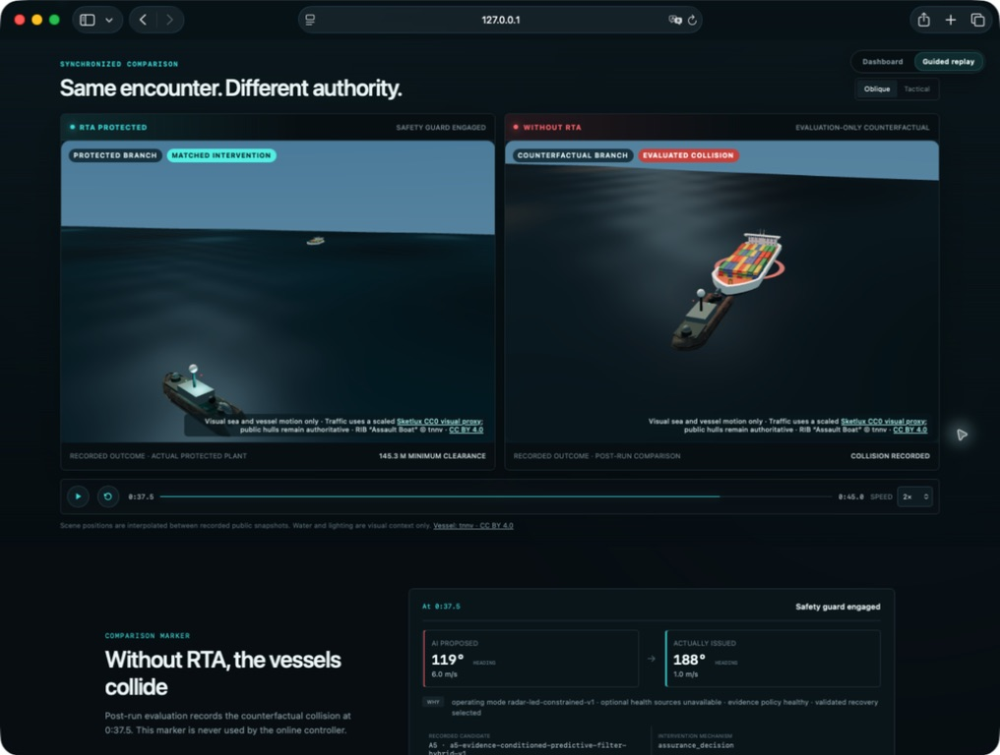
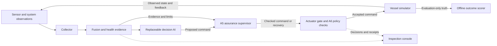
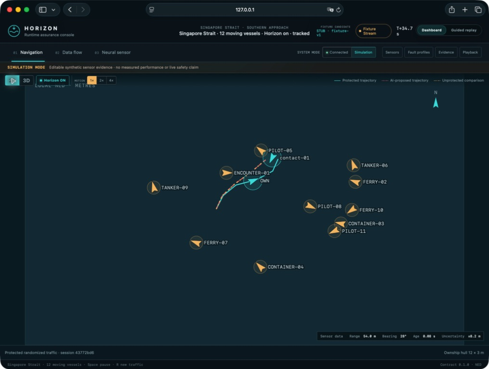
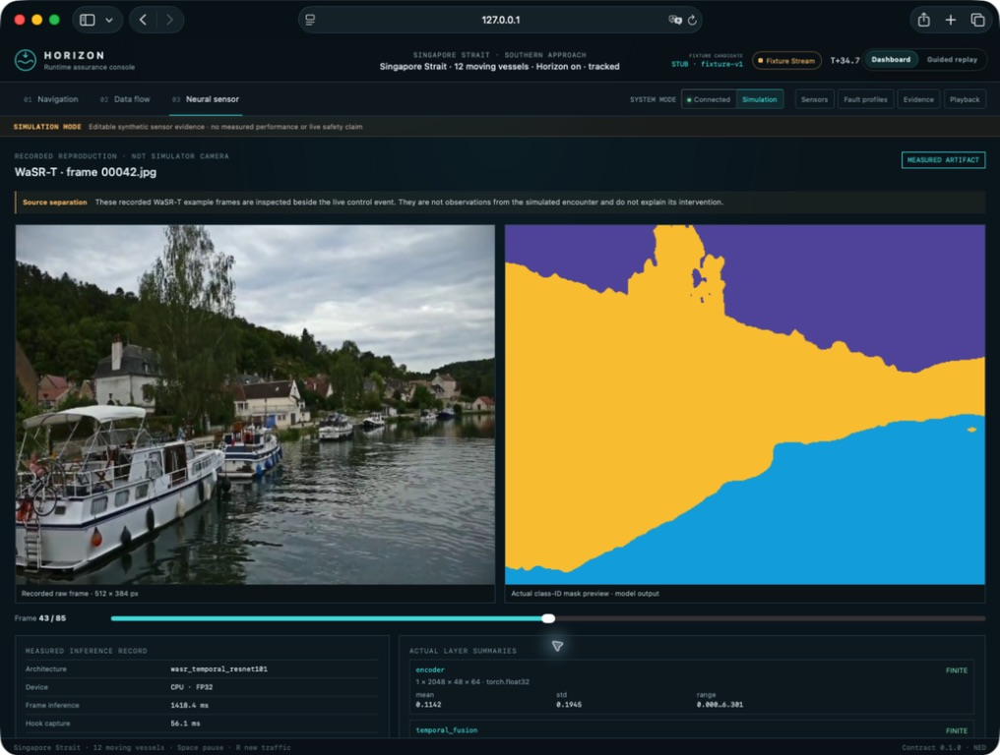
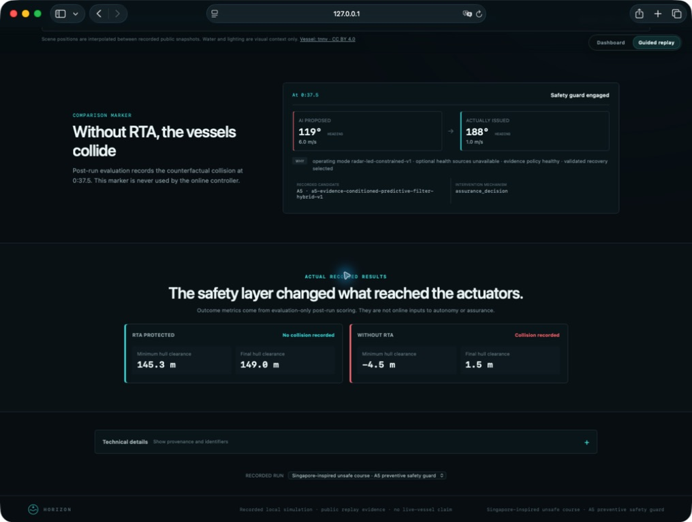

# HORIZON

**Runtime assurance for maritime autonomy.**

An autonomous vessel can receive stale sensor data, trust a frozen camera, or propose a manoeuvre that leaves no safe way out. **Horizon checks the evidence and the proposed command before it reaches the actuators.** When the proposal fails its checks, an independent supervisor can constrain it or select a checked recovery action.

This hackathon prototype brings that idea into a working maritime simulator: a replaceable decision AI, sensor fusion, predictive safety checks, an exclusive actuator gate, and a console that shows **what the AI proposed, what was actually issued, and why**.

[White paper (PDF)](whitepaper/horizon-runtime-assurance-white-paper.pdf) · [LaTeX source](whitepaper/) · [Try the demo](#run-locally) · [Judge walkthrough](#a-three-minute-judge-walkthrough) · [Architecture](#how-it-works) · [Measured results](#what-we-have-tested) · [Technical docs](#explore-the-repository)



*Fresh console capture of the 45-second `unsafe-route-a5-v1` recording at T+37.5 s. Both branches began from the same paused simulator state. Cyan shows the protected plant; red shows an evaluation-only counterfactual. The Singapore-inspired setting is presentation geometry, not a claim of a real-world trial.*

## The problem we are tackling

A plausible AI output is only one part of a reliable autonomous system. The supporting observations can be old, sensors can disagree, a camera can repeat the same image, and a command can arrive after its deadline. Even a reasonable manoeuvre can become unsafe when vessel dynamics, actuator limits, and nearby traffic are considered together.

Horizon makes those dependencies explicit. For example, when a camera becomes unreliable, its output should not silently become permission to proceed. The system preserves that uncertainty, checks which evidence the operating mode requires, and evaluates what can still be safely commanded under its declared assumptions.

The intended use is a test and integration environment for maritime autonomy teams: replace the decision policy, inject failures, compare protected and unprotected behavior, and inspect the complete evidence trail.

## What we built

| Capability | What it does in this prototype |
|---|---|
| **Predictive runtime assurance** | The default A5 supervisor evaluates proposed motion, engineering uncertainty bounds, actuator limits, and the availability of a checked recovery. Alternative A1–A4 candidates support comparisons. |
| **Protected actuation** | An exclusive gate checks command authority, identity, freshness, and deadlines. Its independent watchdog can retain validated recovery when the normal control path fails. A6 adds configured policy authorization for normal A5 commands. |
| **Evidence-aware sensor fusion** | Collector and fusion services preserve source identity, timestamps, uncertainty, and health across navigation, obstacle perception, actuator feedback, communications, and AI telemetry. |
| **Neural perception monitoring** | WaSR-T segments recorded maritime images. H5 inspects its internal temporal features; a separate camera-integrity guard detects sustained exact frame repeats. |
| **An inspectable demo** | A synchronized 2D/3D dashboard, fault controls, a data-flow inspector, recorded perception artifacts, and paired safety replays make the system's decisions visible. |
| **Reproducible evaluation** | Versioned scenarios, shared contracts, pinned artifacts, and linked proposals, decisions, gate receipts, and observed actuator commands support repeatable comparisons. |

The decision AI is a separate process. The included policies are deterministic fixtures, including deliberately unsafe and malformed proposals, so a reviewer can exercise the boundary without an API key or an external AI service. A different autonomy implementation can use the same interface.

## How it works



1. **Observe:** collect sensor and system evidence with explicit source, age, and uncertainty.
2. **Assess:** bind the AI proposal to the evidence it consumed and check the predicted motion and recovery options.
3. **Intervene:** pass an eligible command, constrain it, or select recovery. When assurance cannot be established, report that limitation explicitly.
4. **Enforce and explain:** the gate controls protected actuation; the console follows the evidence → proposal → decision → receipt → observed-command chain.

Evaluation truth and fault labels stay outside online control. The browser receives allowlisted display evidence and mediated operator controls; it does not receive plant-write credentials or direct actuator authority. See [system boundaries](docs/architecture/system.md) and [the assurance implementations](services/assurance/README.md).

## A three-minute judge walkthrough

| Step | What to open | What to look for |
|---|---|---|
| **1. Watch the intervention** | **Guided replay** → **Play safety demo** | The same encounter in protected and unprotected branches. Use **Jump to intervention** to inspect the recorded mechanism. |
| **2. Follow the evidence** | The replay's comparison marker and outcome cards | Compare **AI proposed** with **Actually issued**, then distinguish the command evidence from post-run collision and clearance scores. |
| **3. Explore a failure** | **Dashboard** → **Simulation** → **Sensors** or **Fault profiles** | Change browser-local evidence, inspect **Navigation** in 2D/3D, and follow the selected event in **Data flow**. These are labeled synthetic examples. |
| **4. Inspect perception** | **Neural sensor**, when the recorded artifact is installed | Compare a real recorded image with WaSR-T's class mask and measured layer/timing summaries. This camera sequence is separate from the simulated encounter. |



*Browser-local Simulation mode. Traffic is generated per session; the fixture candidate is visibly labeled `STUB`. This view explains the interaction and does not supply measured safety outcomes.*



*Frame 43 of the installed 85-frame CPU reproduction. These are recorded model outputs, not the simulator's camera and not a visualization of an H5-triggered intervention.*

<details>
<summary>See the recorded command and outcome evidence</summary>



At this replay sample, the AI proposed 6.0 m/s and the matched issued command was 1.0 m/s with a different heading. The outcome cards describe the completed recorded run, not information available to the online controller.

</details>

All four screenshots were captured from the current local console on 25 September 2026. [Screenshot provenance and capture steps](docs/demo/screenshots/README.md).

## What we have tested

**These are separate experiments with different scopes.** The recorded A5 demonstration is evidence of the command-assurance path; it is not evidence that H5 prevented that collision.

| Experiment | Observed result | What it establishes |
|---|---|---|
| **Recorded A5 encounter** — `unsafe-route-a5-v1` | No protected collision; **145.3 m** minimum protected hull clearance. The unprotected comparison records a collision and **−4.5 m** minimum clearance. | One deterministic development scenario demonstrates a preventive intervention through the real local service stack. Negative clearance means simulated hull overlap. |
| **H5 camera blackout** | **20/20** fault frames warned, starting on the first black frame; warning cleared after three recovery frames. | The monitor reacts to this input fault on one development clip. |
| **H5 with frozen-feed guard** | **18/20** frozen frames warned, starting on the third consecutive repeat; cleared on the first changed frame. No warnings on the 60-frame normal control, with the first frame unknown. | Sustained exact-repeat detection works in this offline exercise. The additional trigger is a conventional camera check; the neural model was not retrained. |
| **Broader missed-obstacle proxy rerun** | **7/33 misses detected (21.2% recall)**, **193 false warnings**, **3.5% precision** over 10,110 scored frames. | General missed-obstacle detection remains limited. The freeze guard did not change this result: all 337 duplicate frames were isolated repeats. |
| **Repository checks** — 25 September 2026 | **629 tests passed, 1 skipped**, plus contract validation and console checks/build. | Automated checks cover the implementation; they are not a safety certification. |

Read the [recorded-run methodology](docs/demo/backend-replay.md), [camera-fault results](experiment/reports/h5-frozen-feed-20260925.md), and [broader H5 evaluation](experiment/reports/h5-freeze-accuracy-20260925.md). A separate [24-episode simulation study](experiment/reports/h5-control-response-20260925.md) did not demonstrate a navigation benefit from H5 warnings.

### Where H5 fits

WaSR-T produces obstacle, water, and sky segmentation **without H5**. H5 adds an experimental warning signal by checking the reconstruction and temporal consistency of WaSR-T's internal features. Its freeze guard separately compares decoded image pixels and requires three consecutive duplicates. Exact repeats are covered; re-encoding that changes pixels is outside that guard.

In the opt-in recorded-camera simulation path, either warning can ask the fixture policy to cap its proposed speed at **1 m/s**, subject to A5 and gate validation. A low H5 score does not certify healthy perception or obstacle-free water. Recorded camera images do not react to the simulated vessel, and they do not supply qualified metric contacts. [Perception integration and boundaries](docs/perception/live-recorded-camera.md).

## Run locally

### Full simulator and console

Use **Python 3.12** and a supported **Node.js 22–26 / npm 10–11** installation. Python 3.11–3.13 is supported by the workspace metadata; the local scripts prefer 3.12. Run from the repository root:

```sh
./scripts/bootstrap.sh
./scripts/check.sh
./scripts/launch_cpu.sh
```

Open **[localhost:5173](http://127.0.0.1:5173)**. The default launch starts seven processes: simulator, decision-AI fixture, collector, fusion, assurance supervisor, actuator gate, and console/proxy. It uses A5 with A6 policy enforcement and checks an accepted, identity-linked command and subsequent plant feedback before reporting readiness. No GPU or paid cloud service is needed for this default slice.

Without a configured A6 policy bundle and trusted evidence, normal autonomy is withheld and the gate follows its recovery/minimum-risk path. That is expected under the default configuration. The [A6 setup guide](services/assurance/docs/a6-policy-enforcement.md) explains this behavior; the recorded replay and browser-local Simulation mode remain separate demonstration paths.

- **[Simulation dashboard](http://127.0.0.1:5173/?view=dashboard&mode=simulation):** browser-local, editable synthetic examples.
- **Connected mode:** inspect the running backend. Selecting it requests the application's coordinated restart flow, so use it when ready to restart the demo episode.
- **[Guided replay](http://127.0.0.1:5173/?view=demo):** inspect installed, verified recorded runs. Replay and neural-inspector artifacts are stored outside Git; a fresh clone will show those artifacts as unavailable until they are provided or generated. The synthetic dashboard remains usable.

Press **Ctrl-C** in the launcher terminal to stop its processes. For a short startup check, use `./scripts/launch_cpu.sh --smoke-seconds 2`. Logs and run metadata are written under the sibling `horizon-runs/` directory. See [local runtime details](docs/architecture/local-runtime.md).

### UI-only preview

After bootstrap, the frontend can be explored independently:

```sh
npm --workspace @horizon/console run dev
```

Open **[localhost:5176/?view=dashboard&mode=simulation](http://127.0.0.1:5176/?view=dashboard&mode=simulation)**. This is a browser simulation; it does not start the backend assurance or actuator services.

### Optional recorded-camera processing

With the pinned WaSR-T source, weights, MODD2 development sequence, and perception dependencies installed, run:

```sh
./scripts/launch_cpu.sh \
  --perception-config configs/perception/recorded-camera-live.json
```

This adds a finite 296-frame camera process and enables H5's simulation warnings. Large model/data artifacts are deliberately external. Setup, hash validation, platform requirements, source exhaustion, and diagnostics are documented in the [perception guide](docs/perception/live-recorded-camera.md).

To generate a new local A5 replay from a **clean working tree**, use a new run ID/output directory:

```sh
.venv/bin/python scripts/demo_capture.py \
  --candidate A5 --run-id hackathon-demo-v1 \
  --title "Horizon hackathon safety demo" \
  --output ../horizon-runs/demo/hackathon-demo-v1
```

The recorder pins the source commit and refuses dirty sources or accidental overwrite. Newly generated outcomes can differ from the historical screenshot run. [Replay artifact format](docs/demo/backend-replay.md).

## Explore the repository

| Path | Purpose |
|---|---|
| [`apps/console/`](apps/console/) | React, TypeScript, Three.js, and React Three Fiber inspection UI. |
| [`services/`](services/) | Python simulator, collector, fusion, assurance, gate, perception, and neural-health services. |
| [`fixtures/decision-ai/`](fixtures/decision-ai/) · [`adapters/decision-ai/`](adapters/decision-ai/) | Replaceable autonomy fixtures and the decision-AI integration boundary. |
| [`packages/contracts/`](packages/contracts/) | Authoritative JSON Schema and generated Python/TypeScript contracts. |
| [`experiment/`](experiment/) · [`scenarios/`](scenarios/) | Evaluation harnesses, reports, reproducible scenarios, and failure cases. |
| [`configs/perception/`](configs/perception/) | Camera and monitor settings, dataset splits, and pinned reference identities. |
| [`services/assurance/docs/a6-policy-enforcement.md`](services/assurance/docs/a6-policy-enforcement.md) | Configured command-policy authorization and its supported scope. |

## Current scope and next steps

Horizon is a **research and hackathon prototype**, with no field validation or safety certification. Its physical checks depend on declared engineering assumptions and a characterized simulator. A6 is bounded policy enforcement, not a legal-compliance determination. New marine modes require qualification; recorded perception does not establish real-world safe water, and local/GPU timing does not establish end-to-end real-time performance.

The next milestones are independent held-out perception evaluation, stronger tests of false warnings and missed failures, camera imagery that responds to simulated motion, broader assurance qualification, and integration with an external autonomy stack. Calibration data has been evaluated; the sealed held-out perception partition remains unopened. [Remaining work](docs/architecture/remaining-work.md).

Third-party display assets retain their source attribution and licenses in the [maritime asset registry](assets/maritime/registry.json). This repository does not currently include a project license. Keep credentials, datasets, model weights, raw captures, and generated runs outside Git.
