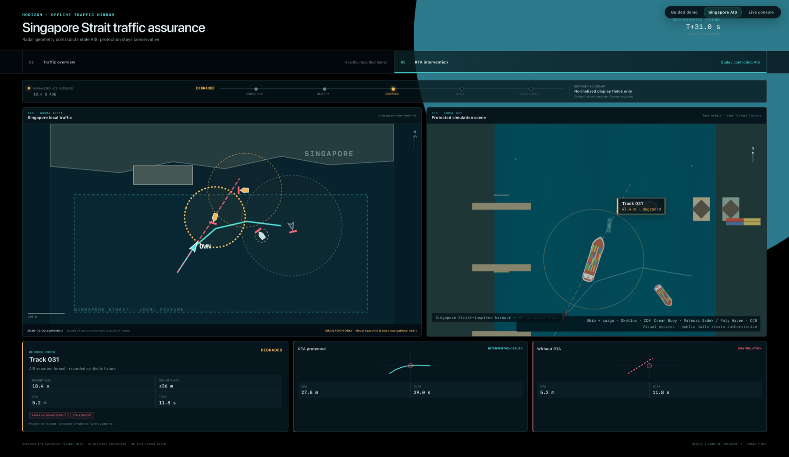
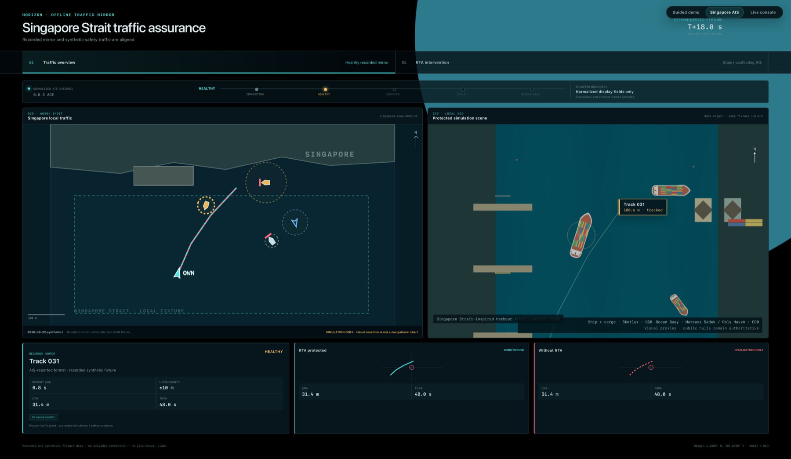

# Horizon

Horizon is a private maritime runtime-assurance research and simulation workspace. It monitors an autonomous vessel's sensor, network, internal communication, neural-perception, and decision-AI evidence, then constrains unsafe commands through an independent safety supervisor and actuator gate.



*Deterministic Singapore-area fixture: stale AIS disagrees with radar, so the RTA preserves a conservative contact and increases closest-point-of-approach clearance. The map and traffic shown here are synthetic, simulation-only fixtures.*

## What the demo shows

- A synchronized Singapore-area WGS84 map and 3D local-NED maritime scene.
- Recorded-mirror, AIS-reported shadow, and synthetic traffic kept visibly distinct.
- Contact age, health, uncertainty, source conflicts, CPA, and TCPA.
- The protected trajectory beside the same unprotected counterfactual.
- Independent radar, camera, and AIS observations generated from simulator-owned traffic plants.
- A browser security boundary that receives normalized display fields rather than provider credentials or raw AISStream frames.

The stable screenshot states are:

- `http://127.0.0.1:5173/?view=singapore&state=overview`
- `http://127.0.0.1:5173/?view=singapore&state=conflict`



*Healthy recorded-mirror overview with the same traffic instant aligned across the 2D map and 3D scene.*

## Run locally

The default local slice starts seven processes: the authoritative simulator,
replaceable decision-AI fixture, observation collector, fusion service, assurance
supervisor, actuator gate, and same-origin browser console. The launcher verifies
an identity-linked input/decision/gate-receipt chain and a subsequent public
actuator observation before it reports the slice ready. An explicit
`--perception-config` opt-in adds an eighth, finite recorded-camera WaSR-T process
with bounded queues, expiry, public readiness, and frame/inference/health
lineage. Its recorded images do not depict the simulated encounter and cannot
create metric contacts or free-space authority.

```sh
./scripts/bootstrap.sh
./scripts/check.sh
./scripts/launch_cpu.sh
```

Open `http://127.0.0.1:5173`. Select **Singapore AIS** for the offline traffic-mirror walkthrough, **Guided demo** for the recorded protected/counterfactual run, or **Live console** for the seven-service stack.

Run the 296-frame development camera source only when its external data and
pinned checkpoint are available:

```sh
./scripts/launch_cpu.sh \
  --perception-config configs/perception/recorded-camera-live.json
```

See the [live recorded-camera boundary](docs/perception/live-recorded-camera.md)
for validation, diagnostics, exhaustion, and shutdown behavior.

The console opens in the guided recorded demo when a verified replay is present and keeps the live seven-service console as a separate mode. The recording compares protected and evaluation-only counterfactual branches from one exact paused-reset state, with evidence-linked intervention and post-run outcome panels. See the [Singapore AIS console](docs/demo/singapore-ais-console.md), [guided demo](docs/demo/guided-demo.md), and [backend replay provenance](docs/demo/backend-replay.md).

Generate the finite 45-second S22 recording from a clean commit without using paid compute:

```sh
.venv/bin/python scripts/demo_capture.py \
  --output ../horizon-runs/demo/unsafe-route-v4
```

Each live launch gets a unique directory under the external `horizon-runs/` location with logs, status, and mode-`0600` local capabilities. Press Ctrl-C for graceful shutdown. Use `./scripts/launch_cpu.sh --smoke-seconds 2` for a finite live smoke run.

The reset flow pauses physics, advances the plant epoch, obtains fresh sensor
evidence and a bounded gate recovery certificate, and requires an explicit
operator Resume. A separate fusion reader publishes sensor-only `RecoveryInput`
records, and the gate polls them without calling the decision AI. The gate
continues only a recovery that finishes validation before its original sensor,
health, option, and compute deadlines; otherwise it reports unknown assurance.
WaSR-T reproduction and development extraction have run locally on Apple MPS
with outputs kept under external `horizon-runs/`. Those runs are development
evidence rather than deployment timing or safety evidence.

A separate bounded NVIDIA L4 run completed all 296 frozen development frames
with CUDA/float16, producing 296 masks, 296 previews, feature records, and five
fixed probes. Relative p95 drift against the paired MPS reference was 0.003637
for encoder features, 0.009944 for temporal features, and 0.002857 for decoder
features; mask-disagreement p95 was 0.000174. These descriptive development
measurements do not establish numerical or safety equivalence, calibrated risk,
or end-to-end 20 Hz operation. The calibration and held-out partitions remain
unopened.

The console renders a checked-in, licensed maritime display pack: a normalized
CC BY 4.0 RIB and CC0 cargo ship, cargo stack, and buoy. Their hashes, dimensions,
licenses, and source provenance are validated. They are presentation assets and
do not change plant dynamics, collision geometry, sensing, or assurance evidence.
See the [asset pack record](docs/realism/assets/maritime-pack.md).

Horizon's compute cap is USD 100: a USD 80 working budget plus a protected
USD 20 reserve. At the 2026-09-22 development snapshot, the external ledger
records USD 0.04250377 of reconciled
spend and no active reservations, leaving USD 79.95749623 in the working budget
and USD 99.95749623 unspent in total. The mutable
`horizon-runs/compute/ledger.json` remains authoritative.

The workspace is still under active validation. It has no safety certification
or field validation. Independent system acceptance,
marine-mode assurance qualification, calibration, and held-out evaluation remain
to be completed before release claims. Recorded-camera execution, GPU timing,
and descriptive backend drift are not safety-equivalence evidence.

See [system boundaries](docs/architecture/system.md), [local runtime](docs/architecture/local-runtime.md), [remaining research and implementation work](docs/architecture/remaining-work.md), [compute controls](docs/architecture/compute.md), and [reviewed source material](docs/source/README.md). JSON Schema in `packages/contracts/schema/horizon.schema.json` is the shared language-neutral interface source.

This repository contains no project license. It must remain private. Large datasets, weights, captures, caches, and generated runs stay outside Git.
