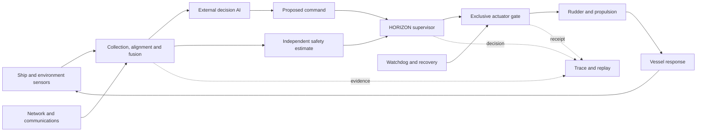

# HORIZON pitch deck plan

## Singapore and Southeast Asia defence-maritime context

**Recommended length:** 14 slides, 8 to 10 minutes  
**Primary audience:** defence innovation judges, naval operators, autonomy engineers, maritime-security stakeholders, and potential test partners  
**Purpose:** present HORIZON as a research demonstrator for independent runtime assurance of autonomous and remotely operated surface vessels in congested Southeast Asian waters

## Narrative position

HORIZON should be presented as an independent safety supervisor that sits between an autonomous navigation system and the vessel's actuators. It checks whether each proposed action remains safe and recoverable using current sensor evidence, source health, vessel capability, and communications state. It can pass, modify, or replace a proposal and retains an independently checked recovery option.

The deck should not claim that HORIZON replaces the Republic of Singapore Navy's Collision Detection and Collision Avoidance system, that it has access to operational RSN interfaces, or that it is ready for deployment. The credible position is that HORIZON explores an additional assurance pattern for future manned-unmanned maritime systems and provides reproducible simulation evidence for further evaluation.

Use a fictional Singapore-inspired operating area. Do not show classified charts, real patrol routes, platform vulnerabilities, weapons, targeting, or engagement functions.

---

## Slide 1: HORIZON

### Purpose

Establish the project and its local relevance in one sentence.

### On-slide text

**Title:** HORIZON  
**Subtitle:** Independent runtime assurance for autonomous surface vessels in congested maritime operations  
**Context line:** Singapore Defence Tech Hackathon 2026, Challenge 4: One Picture, Many Eyes

### Presenter message

HORIZON supervises autonomous navigation decisions while a mission is running. It predicts unsafe vessel behaviour, intervenes before recovery options disappear, and records the evidence behind every intervention.

### Visual direction

Use one strong image or render of an uncrewed surface vessel moving through a busy tropical harbour. Keep the title slide minimal. The vessel should appear among civilian traffic rather than in combat.

---

## Slide 2: Singapore's maritime operating environment

### Purpose

Explain why safe autonomous operation matters specifically to Singapore.

### On-slide text

**Title:** A maritime lifeline under constant traffic

- More than 1,000 vessels traverse Singapore's waters each day.
- Singapore recorded 3.22 billion gross tonnage of vessel arrivals and 44.66 million TEUs of container throughput in 2025.
- Maritime-security systems must operate among merchant ships, harbour craft, patrol vessels, and increasingly autonomous platforms.

### Presenter message

Singapore's geography creates a demanding autonomy problem. The same waters support national survival, global trade, port operations, and maritime security. An autonomous vessel must make safe, predictable decisions without assuming that surrounding traffic is cooperative or digitally trustworthy.

### Visual direction

Use a regional locator map that moves from Southeast Asia to the Straits of Malacca and Singapore, then to a stylised dense-traffic scene. Avoid operational overlays and real patrol routes.

### Evidence

- MINDEF, [The Republic of Singapore Navy's Unmanned Surface Vessels Progressively Operationalised to Enhance Maritime Security](https://www.mindef.gov.sg/news-and-events/latest-releases/04feb25_fs/), 4 February 2025.
- MPA, [Singapore Posts Record Port Performance in 2025](https://www.mpa.gov.sg/media-centre/details/singapore-posts-record-port-performance-in-2025-and-develops-future-readiness-through-industry-collaborations-for-2026), 13 January 2026.

---

## Slide 3: Autonomy is entering operational service

### Purpose

Show that the problem is immediate and aligned with Singapore's defence direction.

### On-slide text

**Title:** Manned-unmanned operations are already taking shape

- RSN Maritime Security USVs began operational patrols in January 2025 alongside Littoral Mission Vessels.
- Singapore's Multi-Role Combat Vessels will act as motherships for surface, air, and underwater unmanned systems.
- The next challenge is system resilience when sensing, communications, software, or vessel capability degrades during a mission.

### Presenter message

Singapore has moved beyond discussing maritime autonomy in the abstract. HORIZON addresses the assurance question that grows with wider adoption: how can an operator know that an autonomous action remains safe when several information sources disagree or arrive late?

### Visual direction

Show a simple progression from a crewed vessel, to a remotely supported USV, to a networked family of unmanned systems. The final frame should highlight the assurance boundary between autonomy and actuation.

### Evidence

- MINDEF, [MARSEC USVs](https://www.mindef.gov.sg/news-and-events/latest-releases/04feb25_fs/), 4 February 2025.
- MINDEF, [Multi-Role Combat Vessels](https://www.mindef.gov.sg/news-and-events/latest-releases/21oct25-fs/), 21 October 2025.
- MINDEF, [Committee of Supply Debate 2026](https://www.mindef.gov.sg/news-and-events/latest-releases/27feb26-speech2/), 27 February 2026.

---

## Slide 4: The assurance gap

### Purpose

Define the failure that HORIZON addresses.

### On-slide text

**Title:** A valid command can still produce an unsafe trajectory

Use one encounter example:

- Radar reports a closing contact.
- AIS reports a safe pass or an inconsistent identity.
- Camera perception degrades in glare or heavy rain.
- The autonomy system proposes a manoeuvre using stale or incomplete evidence.
- The vessel receives a correctly formatted command that is unsafe under the best supportable picture.

**Key line:** Command validity does not establish physical safety or recoverability.

### Presenter message

The important failure does not require a dramatic AI malfunction. A normal autonomy system can act on stale, conflicting, or poorly calibrated information. HORIZON independently checks the proposed action against current evidence and a characterised vessel model before the command reaches the actuators.

### Visual direction

Use one top-down crossing encounter. Overlay a dashed requested path that closes the safety margin and a highlighted contact uncertainty region. Keep the example fictional.

---

## Slide 5: HORIZON's role

### Purpose

State the solution in operational terms.

### On-slide text

**Title:** Independent supervision between autonomy and actuation

HORIZON performs four functions:

1. Builds a time-aligned safety picture with uncertainty and source lineage.
2. Predicts the consequence of the proposed heading, speed, or route.
3. Passes, modifies, or replaces the proposal while recovery remains feasible.
4. Records the decision, gate receipt, and measured vessel response.

**Boundary statement:** The mission AI proposes. The actuator gate decides which checked command can reach the vessel.

### Presenter message

HORIZON does not retrain or rewrite the external autonomy system. This separation allows teams to compare or replace planners while preserving one protected command path and one inspectable assurance record.

### Visual direction

Use a large central assurance boundary placed between an autonomy block and a rudder-and-propulsion block. Avoid a dense software-component diagram on this slide.

---

## Slide 6: Runtime-assurance architecture

### Purpose

Explain how sensor data and commands move through the system.

### On-slide text

**Title:** Sensor evidence becomes a checked vessel command

### Presenter message

The external AI and the safety supervisor receive evidence through separate logical paths. Only the gate can issue the final command. The watchdog can continue a checked recovery manoeuvre if the planner or supervisor misses its deadline. Evaluation-only simulator truth never enters the online safety path.

### Visual direction

Rebuild the diagram as editable slide objects. Use one colour for observed evidence, one for proposed commands, and one for protected commands. Show the evidence path as a thinner secondary line.

---

## Slide 7: Many eyes, one bounded safety picture

### Purpose

Connect the project directly to Challenge 4 and the Southeast Asian maritime environment.

### On-slide text

**Title:** HORIZON preserves disagreement instead of hiding it

Organise the evidence into six visible groups:

- **Ownship state:** GNSS, IMU, heading, speed, depth, and environmental estimates.
- **Contact picture:** navigation radar, electro-optical camera output, neural perception, and AIS.
- **Vessel capability:** measured rudder, propulsion response, power, lag, and equipment health.
- **Data path:** message age, sequence, loss, duplication, and actual AI consumption.
- **Cooperative reports:** peer identity, position, intended manoeuvre, and message age.
- **Decision evidence:** proposed action, model version, input snapshot, timing, and bounded neural-health summaries.

**Key line:** A reported identity or intention cannot erase independently observed contact motion.

### Presenter message

HORIZON treats AIS and cooperative messages as claims that require comparison with radar and camera evidence. It also treats the onboard network and the neural perception system as sources of safety evidence. This exposes whether an unsafe proposal came from physical uncertainty, stale delivery, degraded perception, or the decision logic itself.

### Visual direction

Place a fused contact track in the centre with labelled contributions from radar, AIS, camera, network timing, and source health. Show uncertainty explicitly. Avoid presenting a single unexplained confidence score.

---

## Slide 8: The runtime decision loop

### Purpose

Explain how intervention works without relying on equations.

### On-slide text

**Title:** Every proposal faces the same physical checks

1. Validate authority, timestamp, units, expiry, and input freshness.
2. Predict ownship and contact motion through actuator lag and uncertainty.
3. Check swept-hull separation, navigable water, depth, vessel limits, and supported navigation-rule behaviour.
4. Confirm that a safe continuation or recovery manoeuvre remains available.
5. Pass the proposal, select a nearby valid correction, or enter independent recovery.
6. Recheck the final command before the gate issues it.

### Presenter message

The initial demonstrator uses a deterministic library of course and speed changes. The supervisor prefers the least disruptive valid action. If no ordinary action satisfies every hard constraint, it declares a minimum-risk state rather than presenting an unsafe command as safe.

### Visual direction

Use a horizontal decision flow with three outcomes at the right: pass, modify, and recover. Show the gate after the three outcomes converge.

---

## Slide 9: Singapore-inspired demonstration scenario

### Purpose

Make the pitch concrete and memorable.

### On-slide text

**Title:** One crossing encounter reveals the full evidence chain

**Scenario:** A patrol USV transits a fictional congested harbour corridor among merchant and service traffic.

**Injected conditions:**

- An approaching contact's AIS report conflicts with radar-supported motion.
- Camera perception degrades under tropical glare, rain, or spray.
- A delayed internal message reaches the external AI after its useful validity window.
- The AI proposes a manoeuvre that passes syntax checks but narrows the last viable escape corridor.

**Demonstrated response:** HORIZON retains conservative contact occupancy, rejects stale evidence, modifies the command, and preserves a checked recovery continuation.

### Presenter message

The audience sees the same event in three linked views: navigation, data flow, and neural-sensor health. Selecting the intervention reveals the source observations, the AI proposal, HORIZON's reason code, the gate receipt, and the resulting vessel motion.

### Visual direction

Use a three-frame storyboard: disagreement, unsafe proposal, protected manoeuvre. Keep the geography synthetic and label the scenario as simulation.

---

## Slide 10: Defence-maritime resilience cases

### Purpose

Show operational breadth without drifting into offensive or classified content.

### On-slide text

**Title:** The same assurance pattern covers several failure classes

- **Navigation degradation:** GNSS bias or dropout expands position uncertainty and restricts operation.
- **Contact disagreement:** AIS or peer intent conflicts with radar-supported motion.
- **Perception degradation:** camera blur, occlusion, preprocessing mismatch, or unfamiliar imagery reduces camera trust.
- **Communications degradation:** delayed, reordered, duplicated, or missing messages invalidate stale evidence.
- **Platform degradation:** slow or stuck actuation removes manoeuvres that the vessel can no longer execute.
- **Software failure:** planner or supervisor timeout transfers authority to checked recovery.

### Presenter message

The purpose is resilient navigation in a mixed civilian and security environment. The project excludes weapons, targeting, and engagement decisions. It focuses on keeping an autonomous vessel within a declared operating envelope when information or capability degrades.

### Visual direction

Use a single vessel silhouette surrounded by six labelled failure sources. Do not use a dashboard grid or threat-map aesthetic.

---

## Slide 11: Measurable evidence

### Purpose

Turn the concept into a credible research and evaluation programme.

### On-slide text

**Title:** Paired trials show whether intervention improves the outcome

Compare protected and unprotected simulation branches from the same initial state, traffic, fault schedule, and random seed.

Report:

- physical clearance and boundary violations;
- intervention lead time before the last recovery opportunity;
- false or unnecessary intervention rate;
- mission completion, delay, and added distance;
- supervisor latency and every missed deadline;
- complete sensor-to-command-to-actuation provenance.

### Presenter message

HORIZON should win on measured safety and useful intervention, not on visual polish or a proprietary score. Once the protected command changes vessel motion, the two simulation branches evolve independently. The evaluation process uses ground truth, but the online controller never receives it.

### Visual direction

Show two synchronized trajectories from one starting state. Label one as autonomy only and the other as autonomy with HORIZON. Annotate minimum clearance, intervention time, and mission delay.

---

## Slide 12: Fit with Singapore's autonomy ecosystem

### Purpose

Position the project carefully alongside current Singapore capabilities and standards.

### On-slide text

**Title:** A research layer for assurance, integration, and replay

- Singapore's MARSEC USVs already integrate navigation sensors, charts, AIS, positioning, and collision-avoidance logic.
- HORIZON explores an additional independent supervisor and actuator-gate pattern for heterogeneous planners and degraded evidence.
- The same evidence model supports simulation, controlled trials, operator review, and future assurance cases.
- The 2026 IMO MASS Code reinforces the importance of defined operating modes, risk assessment, connectivity, human oversight, and actions outside the operating envelope.

### Presenter message

The deck must avoid claiming a capability gap in deployed RSN systems. The research contribution is a portable method for exposing assumptions, separating command authority, and replaying exactly why an autonomous action passed or changed.

### Visual direction

Show HORIZON as a research and assurance layer beside, rather than inside, a generic autonomous-vessel stack. Add a small path from simulation evidence to controlled trial evidence.

### Evidence

- DSTA, [Making Waves in Maritime Security](https://www.dsta.gov.sg/whats-on/spotlight/making-waves-in-maritime-security).
- IMO, [International Code of Safety for Maritime Autonomous Surface Ships](https://www.imo.org/en/mediacentre/pressbriefings/pages/imo-adopts-mass-code.aspx), adopted May 2026 and effective 1 July 2026.

---

## Slide 13: Southeast Asian relevance

### Purpose

Broaden the value beyond one Singapore demonstration while remaining evidence-based.

### On-slide text

**Title:** Regional operations combine density, cooperation, and uncertainty

- The Straits of Malacca and Singapore connect regional security with global trade.
- ReCAAP recorded 108 sea-robbery incidents in the straits during 2025, while noting that most incidents across Asia remained in lower-severity categories.
- Singapore contributes to regional mechanisms including the Malacca Straits Patrol and Indonesia-Singapore Coordinated Patrols.
- A common assurance record can support exercises and controlled evaluation across different vessels, sensors, and autonomy providers without requiring one shared planner.

### Presenter message

HORIZON's regional value comes from interoperability at the evidence and safety-contract level. Each partner can retain its own platforms and mission systems while testing whether proposed motion remains supportable under a shared scenario and clearly declared assumptions.

### Visual direction

Use a restrained regional map with commercial sea lanes and partner-country labels. Do not plot incident-level locations or imply current operational deployments.

### Evidence

- ReCAAP ISC, [Annual Report 2025](https://www.recaap.org/resources/ck/files/reports/annual/ReCAAP%20ISC%20Annual%20Report%202025.pdf).
- MINDEF, [IMDEX Asia 2025 opening speech](https://www.mindef.gov.sg/news-and-events/latest-releases/6may25_speech/), 6 May 2025.

---

## Slide 14: Development path and ask

### Purpose

End with a concrete next step rather than a broad ambition.

### On-slide text

**Title:** From reproducible simulation to supervised maritime trials

**Current build target**

- Common data contracts and a closed-loop simulation.
- Interchangeable assurance candidates behind one interface.
- A browser demonstration with paired protected and unprotected runs.

**Next validation steps**

- Replace synthetic vessel parameters with identified dynamics and measured actuator behaviour.
- Calibrate perception and source-health policies on locally relevant, lawfully available data.
- Run hardware-in-the-loop and supervised water trials inside an approved operating envelope.

**Ask**

Seek a technical review and a bounded test partnership covering representative sensor interfaces, vessel dynamics, assurance requirements, and access to a safe trial environment.

### Presenter message

The immediate goal is evidence, not deployment. A suitable partner can help determine whether HORIZON's independent safety boundary adds measurable value to an existing autonomous-vessel development and verification workflow.

### Visual direction

Use a simple three-stage path: simulation, hardware in the loop, supervised water trial. End on the specific partnership ask.

---

## Language and claim discipline

Use these phrases consistently:

- **Independent runtime-assurance supervisor** rather than autonomous safety guarantee.
- **Singapore-inspired synthetic environment** rather than Singapore Strait digital twin.
- **COLREG-inspired or supported encounter subset** rather than fully COLREG compliant.
- **Validated under declared model and bounds** rather than proved safe.
- **Perception-health evidence** rather than proof that a neural prediction is correct.
- **Minimum-risk action with no validated recovery** when all ordinary options fail.

Avoid claims that the prototype is certified, deployment ready, cyber secure, resilient against every adversary, or representative of an operational naval platform. Keep external AI explanations separate from physical safety evidence. Treat cooperative reports as inputs to evaluate, not commands to follow.

## Primary project sources

- [HORIZON runtime assurance concept](./runtime_assurance_uav_concept.md)
- [Maritime RTA research plan](./maritime_rta_research.md)
- [Horizon implementation plan](./horizon_agent_implementation_plan.md)
- [Maritime data survey](./maritime_data_survey.md)

