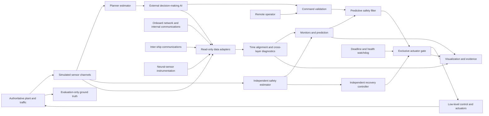

# HARBOR — Runtime Assurance for Autonomous Surface Vessels

**Research-informed hackathon build plan · revised 21 September 2026**  
**Domain:** navigation safety and cross-layer diagnostics for an autonomous defense patrol vessel among civilian traffic.  
**Deliverable:** an interactive maritime simulation, an independent safety supervisor, reproducible fault experiments, and an intervention evidence report.  
**Working name:** HARBOR. The existing filename is retained for continuity; use **USV** for uncrewed surface vessel, since **UAV** normally means an aircraft.

> Demonstrate an autonomous vessel receiving an unsafe command, predicting the consequence, correcting its motion before the hazard becomes unavoidable, and explaining exactly why it intervened.

> **Historical source plan.** Current implementation status is recorded in the
> repository README, `docs/architecture/remaining-work.md`, and the experiment
> claim ledger. Planning references to calibration, MODS, held-out evaluation,
> and 20 Hz operation remain targets unless those current records cite evidence.

This is a build plan, not a report of a completed system. Numerical settings are proposed simulation parameters and acceptance targets, not measured results or operational navigation limits. The reviewed source copy is preserved in this repository; Git history retains earlier revisions.

**Reading guide:** Sections 5–9 define integration and intervention; Section 10 defines the visual product; Sections 11–13 define tests and build milestones; Section 16 specifies the WaSR-T/perception-health experiment; Section 17 selects usable data and repositories. The accompanying interactive console concept is illustrative, not an implemented RTA engine.

## 1. What to build

Build a navigation safety supervisor between a replaceable autonomy controller and the vessel's actuators. It evaluates proposed behavior using independent estimates, predicts near-future motion, and passes, modifies, or replaces the command. It continues operating when the navigation controller freezes or behaves incorrectly.

**The decision-making AI is a separate external system.** HARBOR observes its inputs, outputs, and exposed execution telemetry through an integration contract; it does not replace or train that AI. The required observation scope includes ordinary ship sensors, onboard network traffic, internal ship communications, inter-ship communications, and accessible internals of neural-network-based sensors. Network/AI diagnostics help explain and contain faults; the independent physical safety path remains responsible for actuation.

The product has three connected views:

1. **Mission:** a visually rich 3D coastal environment with civilian traffic, wakes, a patrol route, shallow water, and a protected boundary.
2. **Assurance:** proposed and accepted trajectories, uncertainty bounds, binding constraints, and current control authority.
3. **Evidence:** synchronized protected/unprotected runs, intervention timestamps, minimum clearance, mission completion, and replayable explanations.

The first concrete neural-perception integration is **WaSR-T + MODS + a bounded perception-health virtual sensor**, with single-frame WaSR as a baseline. Section 16 defines reproduction, representation analysis, calibration, and the connection to physical safety. This sensor-perception model is distinct from the external decision-making AI.

The headline interaction is **“Inject unsafe command.”** The planner tries to cut through a civilian crossing encounter or leave its corridor. A dashed red prediction shows the consequence. The supervisor selects a feasible correction, the vessel physically executes it, and the interface explains the changed command. A counterfactual branch shows what happens without assurance.

“Goes rogue” means observable unsafe behavior, not an inferred mental state. The system need not decide whether the cause is a bug, a bad objective, corrupted navigation, or an unauthorized command before containing it.

Scope covers collision and grounding prevention, navigation boundaries, command integrity, degraded sensing, propulsion/steering limitations, and operator handover. No weapons, targeting, engagement decisions, or combat tactics are modeled. Defense relevance comes from retaining navigation safety when mission autonomy or communications fail.

## 2. Changes from the original concept

| Original emphasis or assumption | Revised decision | Reason |
|---|---|---|
| Six to eight weeks of study before implementation | Build through evidence-based milestones without an arbitrary hackathon time cap | Deliver a functioning demonstration |
| A specific neuro-symbolic Decision Transformer is central | Controller-independent interface; begin with waypoint and faulty controllers | Demonstrate assurance independently of model choice |
| CBF/QP as the default answer | Predictive safety filter plus Simplex-style takeover first; evaluate CBFs against that baseline | Account for inertia, lag, obstacles, and recovery feasibility |
| Stop, anchor, or loiter as universal fallback | Select a maneuver whose swept path and continuation fit the situation | Stopping may leave a vessel drifting or in traffic |
| One shared world estimate establishes independence | Separate safety estimator and explicit common-cause assumptions | Two consumers of one corrupted estimate are not independent |
| A convex solver provides assured real-time safety | Check feasibility, residuals, command age, and deadlines; retain recovery | Solver success and safety are different claims |
| Multiple simulators and partnerships are prerequisites | One authoritative numerical simulator and one renderer; adapters later | Avoid inconsistent vessel states and integration sprawl |
| Singapore Strait is the validated starting ODD | Synthetic Singapore-inspired harbor first; sourced local data later | Attractive geography is not validated bathymetry |
| “COLREG-complete” and “proved recoverable” language | Enumerated coverage and assumption-scoped evidence | A demonstration cannot establish unrestricted maritime compliance |

## 3. Research findings and their implications

These primary papers, official repositories, and official regulatory sources were checked for this revision. The final column contains recommendations for HARBOR, not claims that a source has validated this system.

| Source | Supported finding | Build implication |
|---|---|---|
| [ASTM F3269-21 public scope](https://store.astm.org/f3269-21.html) | RTA separates complex functions from monitoring, recovery, and switching; developed for aircraft/UAS | Borrow the architecture; do not claim maritime certification or access to the full paid standard |
| [Wabersich & Zeilinger, predictive safety filter, 2021 version](https://arxiv.org/abs/1812.05506) | Proposed inputs can be checked and modified using predictive control with uncertainty | Check consequences and recoverability, not just immediate command limits |
| [Paine et al., distributed USV CBFs, January 2026 preprint](https://arxiv.org/abs/2601.11335) | Authors report simulation and physical-vessel experiments combining safety filtering and COLREG behaviors | Reproduce as a comparison method; its result is not a guarantee for another hull |
| [Fossen's marine craft model](https://www.fossen.biz/html/marineCraftModel.html) | Marine dynamics include inertia, hydrodynamic forces, and frame transformations | Simulate motion and lag rather than instant heading changes |
| [Python Vehicle Simulator](https://github.com/cybergalactic/PythonVehicleSimulator) | Open USV and ship dynamics and guidance/control examples | Reuse a documented model, record provenance, and validate the adapter |
| [CommonOcean-Sim author paper, ITSC 2025](https://hanna.krasowski.io/assets/pdf/authorversions/CommonOcean_Sim_ITSC_2025.pdf) | Configurable multi-agent maritime scenarios support custom controllers and repeatable experiments | Add scenario import/reactive traffic after the core loop; not a complete COLREG oracle |
| [MIT MOOS-IvP COLREG behavior documentation](https://marine-robotics.mit.edu/ivpman/pmwiki/pmwiki.php?n=BHV.Colregs) | Established behavior-based implementation considers CPA and encounter behavior | Use as comparator or later adapter; independently check its recovery proposals |
| [Virtual RobotX official repository](https://github.com/osrf/vrx) | Maritime USV simulation; recommends ROS 2 Jazzy with Gazebo Harmonic for new users | Later sensor/physics cross-check, not an initial dependency |
| [IMO MSC 111 summary](https://www.imo.org/en/mediacentre/meetingsummaries/pages/temporary-msc-111.aspx) and [resolution index](https://www.imo.org/en/knowledgecentre/indexofimoresolutions/pages/msc-2026-27.aspx) | MSC.595(111) is the non-mandatory MASS Code, effective 1 July 2026; stated application is SOLAS Chapter I cargo ships | Commercial maritime context, not automatic regulatory coverage for a defense patrol craft |
| [USCG publication of international/inland navigation rules](https://www.navcen.uscg.gov/navigation-rules-amalgamated) | Safe speed, collision risk, avoidance action, encounter duties, and restricted visibility have distinct provisions | Select international-rule text; enumerate supported encounters and uncertainty states |
| [React Three Fiber](https://github.com/pmndrs/react-three-fiber) and [Three.js ocean example](https://threejs.org/examples/webgl_shaders_ocean.html) | Browser-based interactive 3D and ocean rendering are available | Custom presentation layer separated from authoritative simulation |
| [OSQP documentation](https://osqp.org/docs/) | OSQP solves convex quadratic programs | Suitable for a derived QP filter, not the full nonlinear maritime problem directly |
| [NMEA 0183](https://www.nmea.org/nmea-0183.html), [NMEA 2000](https://www.nmea.org/nmea-2000.html), and [IEC 61162-450:2024](https://webstore.iec.ch/en/publication/72731) | Marine interfaces include serial, CAN-based, and Ethernet-based data exchange | Build protocol adapters matched to actual equipment; the public descriptions are not the full licensed protocol specifications |
| [OpenTelemetry signals](https://opentelemetry.io/docs/concepts/signals/) and [W3C Trace Context](https://www.w3.org/TR/trace-context/) | Traces, metrics, logs, and propagated correlation context support distributed observability | Link observation, message receipt, AI inference, command, and actuation; correlation context is not authentication |
| [PyTorch module hooks](https://docs.pytorch.org/docs/stable/generated/torch.nn.Module.html), [ONNX Runtime profiling](https://onnxruntime.ai/docs/performance/tune-performance/profiling-tools.html), and [Captum](https://captum.ai/docs/introduction.html) | Supported tools expose module execution, performance profiles, and feature/layer attribution | Instrument accessible neural sensors; runtime profiling alone does not reveal all intermediate tensors |
| [Adebayo et al., Sanity Checks for Saliency Maps](https://arxiv.org/abs/1810.03292) | Attractive saliency maps can fail to reflect learned model behavior | Validate interpretation methods; do not treat a heatmap as a causal explanation or safety certificate |

The recommended synthesis is **predictive filtering + independent recovery + explicit limits on the claim**. A learned controller can be added without becoming the safety authority.

## 4. A concrete demonstration world

### Mission and vessel

Use one generic 12 m patrol USV transiting a 3 km × 2 km fictional coastal test area. Evoke a busy Southeast Asian port through traffic, cranes, breakwaters, and lighting without claiming to reproduce an actual navigation chart. Model a rudder-and-propeller vessel first; other actuator layouts need separate characterization.

All initial settings are editable, versioned simulation assumptions:

| Parameter | Starting setting | Qualification |
|---|---|---|
| Hull | 12 m length, 3 m beam, 1 m draft | Synthetic, not a real platform specification |
| Speed | Mission 4 m/s; command ceiling 6 m/s | Safe speed may be lower |
| Traffic | 4–12 background contacts | Cooperative and non-cooperative motion |
| Environment | Bounded wind/current; begin with current up to 0.5 m/s | Bounds reflected in prediction and tests |
| Water | Synthetic depth field, tide offset, chart uncertainty | No real-world under-keel-clearance claim |
| Clearance | Initially 20 m beyond combined hull envelopes | Test parameter, not a universal COLREG distance |
| Sensors | GNSS, IMU, radar tracks, AIS, actuator feedback | Separate rates, uncertainty, and failure injection |
| Visibility | Clear/in-sight encounters for primary rule coverage | Fog is degraded/unsupported until Rule 19 is separately implemented |
| Oversight | Remote operator interface and modeled link status | Onboard recovery cannot depend on timely human response |

Run acceleration, stopping, turning-circle, and zig-zag characterization before enabling safety claims. Record speed-dependent recovery envelopes, lag, saturation, and prediction errors. Choose a horizon containing a validated recovery maneuver from allowed starting states. Otherwise lower the permitted speed or extend the horizon.

### Assurance assumptions

The demonstrated claim depends on bounded estimation error, bounded disturbances, correct configuration, sufficient actuator authority, a functioning gate/recovery process, and an initially recoverable state. Declare bounds on contact behavior. No local controller can guarantee avoidance against every possible motion of another vessel.

Show three distinct outcomes:

- **Recovery validated under the configured model and bounds.**
- **Recovery attempted; assumptions degraded or validation unavailable.**
- **No feasible recovery found; minimum-risk action active.**

Failure of a finite candidate search does not prove that no recovery exists. A visually clear path does not prove that the vessel can execute it.

## 5. Architecture and command authority



### Trust boundary

The planner proposes heading/speed or a timed route segment. It cannot directly write actuators, alter thresholds, change its authority, or disable logging. The low-level tracker, actuator model, gate, safety estimator, watchdog, and recovery controller are assurance dependencies requiring their own tests.

Run planner, supervisor, and gate/recovery as separate processes. Use distinct permitted message types and a gate-owned authority token. Every accepted command carries sequence number, source, timestamp, expiry, and the state/configuration version against which it was checked. Demonstrate bypass and stale-command rejection. Process separation on one laptop is an architecture boundary, not protection from a compromised host kernel or common power failure.

The safety estimator receives noisy observations, not fault labels or privileged simulator truth. It checks timestamps, associations, and sensor consistency independently. Only the evaluation process reads true states to score outcomes. Estimated and ground-truth views must be visibly distinct.

| Component | Responsibility | Must not assume |
|---|---|---|
| Command validator | Reject malformed, stale, unauthorized, out-of-range, discontinuous requests | Authenticated means safe |
| Supervisor | Predict consequences and select minimally disruptive valid commands | Present clearance implies recoverability |
| Recovery controller | Continue a checked maneuver when the planner is unavailable/rejected | The last safe command remains safe indefinitely |
| Gate/watchdog | Exclusive authority, command expiry, fallback on late/missing output | A missing packet means hold full thrust forever |

One component owns the final command. Avoid independent filters sequentially changing commands without revalidating the final trajectory.

### 5.1 Required data inputs and access points

Use an onboard collector and versioned adapters. Passive observations and application-side telemetry are separate evidence sources. A received packet is not proof that an application consumed it, and an application log is not proof that a command reached an actuator.

| Input plane | Typical data to ingest | Access method | Questions answered |
|---|---|---|---|
| Navigation/environment sensors | GNSS position/time/quality, IMU, gyro/heading, speed log, depth/echo sounder, wind, radar detections/tracks, AIS, EO/IR camera outputs | Serial/CAN/Ethernet gateways and sensor APIs; retain raw observation references | Is the estimate fresh, physically consistent, and adequately supported? |
| Machinery/actuation | Rudder feedback, shaft/RPM/thrust estimate, power, fuel/battery, temperatures, bilge/fire alarms when modeled | Vessel gateway/device interface | Can the vessel execute the requested recovery? |
| Network layer | Observed endpoints, interfaces, transport/protocol, sequence/timestamps, volume/rate, loss/reordering estimates, capture drops, schema/length errors; decoded allowlisted payloads where available | Read-only TAP/SPAN/capture or simulation transport mirror, plus endpoint instrumentation | Was the source-to-consumer path delayed, duplicated, altered, or interrupted? |
| Internal communications | Sensor-to-fusion topics, fusion-to-AI state, AI-to-guidance proposals, guidance-to-gate commands, operator messages, acknowledgements, heartbeats, configuration events | Middleware/API adapters and explicit send/receive/consume events | What did each onboard component actually receive and use? |
| Inter-ship communications | Cooperative position/intention reports, safety messages, message age, sender identity evidence, acknowledgement, stated course/speed/route when available | Radio/data-link gateway logs and application APIs; AIS handled as an untrusted contact source | Does communicated intent agree with independent observed motion? |
| External decision-making AI | Exact input snapshot references, model/runtime version, inference start/end, route/action proposal, validity horizon, candidate scores if exposed, consumed message IDs, structured decision factors | An integration adapter/SDK provided by the separate AI system | Did it act on stale/wrong inputs, and is the resulting action safe? |
| Neural sensors | Preprocessed input reference, inference ID, weights/preprocessor version, intermediate activation summaries, logits/detections, runtime faults and timing | In-process instrumentation or explicitly supported vendor diagnostic export | Is perception failing, numerically unstable, or behaving outside its validated reference distribution? |

Map adapters to the installed stack rather than assuming every ship uses ROS or one marine bus. Initial simulation adapters should exercise one ordinary marine data source, one internal pub/sub stream, one inter-ship message stream, and one instrumented neural sensor. Real NMEA/IEC field decoding needs the applicable specification and device documentation. [NMEA interfaces](https://www.nmea.org/nmea-2000.html), [IEC Ethernet interface scope](https://webstore.iec.ch/en/publication/72731).

Encrypted traffic reveals only available metadata at a passive tap. Obtain semantic fields through authorized endpoint instrumentation after decryption; never claim that packet inspection alone exposes encrypted payloads or hidden activations. Onboard address/source fields and AIS identities are not inherently cryptographic identity. An inter-ship message can be genuine yet mistaken, so treat reported intent as a hypothesis rather than an instruction to ownship.

If voice communications are later included, ingest an available recording/transcript through a gateway with speaker uncertainty, transcription confidence, and timing. A transcript is advisory context, not an authenticated helm command. Voice processing is an extension to the initial structured-message implementation.

### 5.2 Correlation, provenance, and data quality

Create a causal record for each acted-on proposal:

```text
sensor sample / camera frame
  → preprocessing and sensor-model inference
  → detection or track
  → message sent / received / consumed
  → external decision-AI input snapshot and proposal
  → HARBOR assessment and issued command
  → actuator receipt and measured physical response
```

Every event carries `source_id`, `boot/session_id`, `sequence`, `event_time`, `receive_time`, `clock_uncertainty`, `schema_version`, `validity`, and parent observation/message/inference IDs. Add model/preprocessing/configuration hashes where applicable. Use monotonic local clocks for expiry. Cross-host one-way delay requires synchronized clocks with a declared error bound; otherwise report bounded age, ordering, and round-trip information rather than precise invented delay.

W3C trace IDs and OpenTelemetry-style spans are useful where the middleware can propagate them. For legacy messages, gateway mappings may only establish tentative correlation. Mark missing links as **unknown**, not inferred certainty. Hashes connect artifacts and detect changes relative to a trusted reference; a hash supplied solely by an untrusted process does not prove authenticity. [Trace Context](https://www.w3.org/TR/trace-context/), [OpenTelemetry](https://opentelemetry.io/docs/concepts/signals/).

Never multiply correlated confidence values as though AIS, a fused track, and the AI input were three independent sensors. Record common ancestry. Track stale/missing observations and collector/capture loss explicitly; collector overload must not masquerade as vessel-network failure.

### 5.3 Inspect neural-network sensors from inside

Internal inspection is a required capability when the sensor model/runtime is accessible. Expose an **inspection capability manifest** per component: input/output-only, intermediate tensors available, weights/graph available, gradients available, and runtime profiling available. Closed vendor appliances may expose only outputs. Display the limitation and use external consistency checks; no software can recover arbitrary hidden network states just from detection packets.

| Diagnostic | What to record/compute | Interpretation and limitation |
|---|---|---|
| Input/preprocessing | Frame/sample ID, shape, channel order, scaling, crop, calibration and preprocessing hash; image quality metrics | Catch normalization, calibration, frozen-frame, exposure, and malformed-input faults |
| Layer activations | Selected layer names, shapes, finite-value counts, mean/std/quantiles, norms, activation-specific saturation/sparsity | Detect deviations from that model/layer's reference; zeros or large values are not universally faulty |
| Feature distribution | Fixed-layer embeddings and a calibrated distance to nominal reference sets | OOD/drift evidence, not certainty that a prediction is wrong; references depend on conditions and model version |
| Output behavior | Class logits when available, scores, box/track geometry, temporal consistency, cross-sensor disagreement | High confidence can accompany an incorrect detection; entropy alone is insufficient |
| Runtime integrity | Loaded artifact identity, expected graph, device/provider, precision, inference timing, memory/runtime errors, non-finite tensors | Establish version/performance anomalies; a trusted load check is stronger than self-reported metadata |
| Attribution | Selected-frame Integrated Gradients or appropriate layer attribution; optional attention views | Investigation aid, not a full account of reasoning or proof of causation |
| Controlled diagnosis | Replay the same frame with baseline preprocessing/model; offline occlusion/ablation experiments | Stronger evidence about a suspected dependency; perturbed inputs may themselves be out of distribution |

For an accessible PyTorch sensor, instrument selected modules with forward hooks that observe without mutating outputs; bound sampling and tensor retention. For ONNX/compiled engines, use supported profiling and an explicitly exported diagnostic graph exposing selected intermediates when possible. Fusion/quantization can change layer correspondence and timing, so compare instrumented and deployed outputs and benchmark overhead. [PyTorch hooks](https://docs.pytorch.org/docs/stable/generated/torch.nn.Module.html), [ONNX profiling](https://onnxruntime.ai/docs/performance/tune-performance/profiling-tools.html).

Keep inexpensive summaries online and heavy attribution on an asynchronous diagnostic worker or replay process. Do not retain full tensors for every frame. Use bounded ring buffers and trigger-selected retention, for example a configurable 10 s pre-event and 20 s post-event window. Retain a raw frame only where needed for reproducibility and permitted by the run's data policy. Measure bandwidth, memory, dropped diagnostics, and any GPU synchronization overhead.

Calibrate alarms on nominal data and evaluate held-out weather, lighting, occlusion, and preprocessing faults. Validate saliency with appropriate sanity checks and controlled perturbations; a visually plausible heatmap is insufficient. Do not claim that any one neuron represents “rogue intent.” [Captum](https://captum.ai/docs/introduction.html), [saliency sanity-check research](https://arxiv.org/abs/1810.03292).

### 5.4 External decision-AI integration contract

The separate decision AI publishes its proposed action and the exact observations it consumed. Additional telemetry is optional and capability-declared: candidate actions/scores, explicit objective/constraint configuration, behavior state, feature summaries, and inference/runtime health. If its internals are available, apply the same instrumentation approach; HARBOR's core must still operate on input/output-only integration.

Use structured decision factors and observable traces; do not require hidden chain-of-thought or treat generated explanations as a trustworthy reason for an action. Even a complete, plausible self-explanation does not authorize unsafe motion. HARBOR checks the proposed action independently and may quarantine the external AI's command authority without modifying its weights or internal execution.

A test-double AI service is needed to exercise this contract in the hackathon. It is explicitly a stand-in for integration testing, not a proposal to rebuild the external decision system. Acceptance includes swapping two test-double implementations without changes to the safety kernel.

### 5.5 Separate diagnostics from deterministic enforcement

Use a fast safety path for validated freshness, consistency, capability, and physical-trajectory constraints. Use an asynchronous diagnostic path for cross-layer correlation, activation analysis, and explanations. A neural diagnostic anomaly can reduce trust or request reevaluation under a calibrated policy, but cannot alone prove malicious behavior or authorize an arbitrary maneuver.

Example policies:

- **Stale input at AI consumption:** reject the proposal's expired evidence and predict from the freshest independently supportable state.
- **Camera-model activation drift plus radar disagreement:** mark camera-derived tracks suspect, maintain conservative radar-supported occupancy, and reassess safe speed/route.
- **Missing neural telemetry:** display inspection unavailable; apply the declared capability/ODD policy rather than claiming the model is healthy.
- **Inter-ship message contradicts radar:** preserve observed contact occupancy; do not steer solely according to the received claim.
- **Anomalous network flow without demonstrated safety impact:** record/inspect it; avoid an unnecessary helm intervention.

Rate-limit and isolate collectors, parsers, model diagnostics, and report generation. Flooding telemetry or crashing an attribution worker must not starve the safety supervisor. Control authority changes happen only through the gate; diagnostic tools cannot silently reconfigure models, sensors, or vessel networking.

## 6. Intervention algorithm

### Main path: predictive filtering

At every supervisor tick:

1. Validate snapshot and proposal: sensor age, actuator state, authority, units, and command expiry.
2. Predict vessel motion through the low-level tracker and actuator lag. Propagate state uncertainty and contact-motion bounds.
3. Check swept hull separation, navigable-water containment, depth, actuator/rate limits, and supported encounter obligations throughout the horizon.
4. Require a viable continuation or checked recovery maneuver at the end. Avoiding collision for only the next few seconds is insufficient.
5. Pass a valid proposal. Otherwise evaluate nearby commands and recovery maneuvers jointly against all contacts and boundaries.
6. Independently check the chosen result's constraints/residuals before issuing its next short segment. Retain the recovery continuation and its validity assumptions.
7. If no new result arrives before deadline, use the still-valid recovery continuation. If its validity expires, the independent recovery process acts and explicitly downgrades assurance status.
8. Log inputs, rejected/issued commands, binding constraints, margins, authority, gate receipt, and runtime.

Start with a deterministic library of parameterized maneuvers: speed reduction, bounded course changes with speed profiles, and transit to a designated refuge when reachable. Use deterministic tie breaks and a continuity cost to avoid alternating helm commands.

Call this first implementation a **sampled predictive shield**. Its search is incomplete. Later add constrained predictive optimization and a terminal recovery-set argument. The theory motivates that progression; its guarantees do not automatically transfer to a sampled approximation. [Predictive safety filter paper](https://arxiv.org/abs/1812.05506).

Optimize deviation from the requested heading/speed, changes from the previous command, and mission delay. Hull collision, grounding, and actuator limits remain hard constraints while feasible. If they cannot all be met, enter a separately labeled minimum-risk problem. Never hide collision slack inside an ordinary “safe” result.

### Fast screening and long-horizon checks

CPA/TCPA helps screen contacts and explain decisions, but constant-velocity calculations miss turns and uncertainty. Use conservative screening before detailed rollout. Add a slower strategic monitor for bottlenecks and boundaries beyond the tactical horizon.

Test swept hulls between rollout samples: a coarse grid can jump through a ship or a narrow boundary. Use continuous segment checks or conservative swept-volume bounds and refine near hazards. Grow contact envelopes with uncertainty, latency, closure, and modeled maneuvering bounds.

### Where CBF/QP fits

Evaluate a control-barrier-function filter as an alternative or carefully integrated inner layer once the plant/tracking model is stable. For a control-affine model, a representative robust condition is:

\[
\min_{w\in\mathcal W}\left[L_fh(x)+L_gh(x)u+L_wh(x)w\right]+\alpha(h(x))\geq0.
\]

This requires a suitable differentiable barrier, valid disturbance bounds, feasible inputs, and appropriate relative degree. Position separation generally does not depend directly on rudder input at its first derivative. Use higher-order/discrete-time formulations or a justified tracking abstraction instead of applying a point-robot equation to a ship.

Include sampled-data margins, estimation error, solver tolerances, and feasibility in any claim. Clipping actuators after filtering can invalidate the result. Recent USV research is a useful reproduction target, not a turnkey proof for this design. [Paine et al.](https://arxiv.org/abs/2601.11335).

### Recovery selection

Select behavior that preserves separation and steerage in the available water. Depending on the scene, this can mean slowing, turning, continuing through a narrow passage, or reaching a checked holding area. A refuge is valid only while its approach and occupancy remain viable under modeled traffic and disturbances.

Stopping requires a checked stopping/drift path. Anchoring is outside the initial implementation: it needs equipment, seabed, deployment, and swing-circle modeling. With degraded steering or propulsion, recompute available maneuvers using the degraded plant rather than requesting impossible corrections.

## 7. Monitor catalogue

| Monitor | Quantity and inputs | Response | Demonstration |
|---|---|---|---|
| Collision | Relative state/error bounds, swept hull clearance, time to margin violation | Reject before loss of a validated recovery option | Planner cuts across civilian traffic |
| Boundary | Predicted hull-to-boundary distance with uncertainty | Constrain early enough to remain recoverable | Corrupted waypoint |
| Grounding | Depth + tide − draft − squat allowance − uncertainty | Exclude paths with insufficient UKC | Synthetic shoal |
| Navigation integrity | GNSS/IMU/radar consistency, fix age, residuals | Enlarge bounds, restrict operation, reject affected channel when justified | Measurement-only GNSS bias |
| Contact integrity | AIS/radar disagreement, association ambiguity, age | Retain hypotheses or conservative occupancy | AIS says miss, radar says closing |
| Plant capability | Requested/measured rudder and thrust, tracking error, lag | Update capability and recovery | Stuck/slow rudder |
| Command integrity | Format, ranges, authority, sequence, time, expiry | Reject and use valid continuation | Stale/replayed message |
| Planner health | Deadline, heartbeat, output validity | Replace planner authority | Process kill |
| Supervisor health | Deadline, output validity, gate heartbeat | Independent gate/recovery takeover | Filter timeout/crash |
| Communications | Operator-link age and handover state | Onboard recovery; remove unavailable authority | Link loss during avoidance |
| Data path | Send/receive/consume lineage, clock uncertainty, sequence gaps, capture loss | Reject stale evidence and identify affected components | Delayed radar-to-AI stream |
| Inter-ship consistency | Claimed intent/identity evidence versus independent tracks | Conservative occupancy; flag contradiction | Peer claims to yield but maintains course |
| Neural sensor health | Input quality, artifact version, layer summaries, feature drift, output consistency | Bounded diagnostic alert and calibrated trust reduction | Perception preprocessing mismatch |
| Recoverability | Valid continuation count/quality, terminal behavior, margins | Act before options disappear | Several contacts close an escape corridor |

Every monitor has units, source provenance, stale-data behavior, trigger/clear thresholds, rate, hysteresis, and a requirement ID. Do not replace them with an unexplained “AI confidence” score.

Separate physical boundaries such as land from operational restrictions such as a mission corridor. A configured emergency policy can prioritize avoiding physical harm when restrictions conflict; record every exception explicitly. This prototype's interpretation is not a legal determination.

Start COLREG-inspired behavior with clear two-vessel head-on, crossing, and overtaking encounters, then controlled multi-contact compositions. Encode encounter memory and hysteresis. Track collision avoidance separately from rule conformance. Stand-on behavior is not permission to maintain course into an unavoidable collision; restricted visibility needs separate handling. Review international Rules 2, 5–8, 13–17, and 19 in the [published navigation rules](https://www.navcen.uscg.gov/navigation-rules-amalgamated). Do not label the demonstration “fully COLREG compliant.”

## 8. Modes and human control

Replace the degradation ladder with two independent state dimensions:

- **Authority:** autonomy, filtered autonomy, recovery controller, remote operator.
- **Assurance health:** within assumptions, degraded assumptions, no validated recovery.

An available operator is not automatically a safer physical condition.

| Event | Authority/action | Return condition |
|---|---|---|
| Proposal passes, required data fresh | Autonomy through gate | Continuous revalidation |
| Proposal fails; valid correction exists | Filtered autonomy | Margins clear for configured dwell time |
| Repeated unsafe proposals/planner unavailable | Recovery; planner quarantined | Operator acknowledgement plus healthy observation interval |
| Navigation error exceeds validated bound | Recovery with degraded status, if supportable | Independent localization restored and acknowledged |
| Remote takeover requested | Retain current control through authentication, state synchronization, and acknowledgement | Explicit release and safe-transition checks |
| Remote link expires | Onboard recovery | A new completed handover, not just a heartbeat |
| Supervisor deadline missed | Valid stored recovery then independent recovery process | Health restored, cause recorded, re-entry checks passed |
| No candidate passes | Minimum-risk action, “no validated recovery” status | Latched pending reassessment and acknowledgement |

Small routine corrections may clear automatically after hysteresis. Serious integrity faults and quarantined planners cannot silently regain control. Specify a complete priority table for simultaneous faults. Remote commands use the same safety path in this demo. RTA-disabled comparison happens in a separate simulation branch.

## 9. Engineering stack and simulation fidelity

### Recommended stack

| Layer | Selection | Purpose |
|---|---|---|
| Console | React + TypeScript + Vite | Interaction, event inspection, local packaging |
| 3D | Three.js through React Three Fiber | Ocean, meshes, cameras, trajectory geometry |
| Tactical view | Orthographic camera over the same scene, SVG/HTML labels | Consistent coordinates/timestamps |
| Numerical simulation | Python fixed-step service; documented Fossen-style surface-vessel model | Headless experiments and inspectable physics |
| RTA | Separate Python service; rollout and deterministic maneuver search first | Fast experimentation with visible assumptions |
| Gate/recovery | Separate process, minimal protocol, watchdog | Survive planner/supervisor failure |
| Transport | Typed local messages; WebSocket display snapshots | Browser cannot block the control loop |
| Collection/correlation | Protocol adapters plus bounded event buffers and OpenTelemetry-style spans | Link physical observations, network delivery, AI consumption, and actuation |
| Model inspection | Inference-runtime hooks/diagnostic export; asynchronous Captum/replay worker where compatible | Selected-layer telemetry and investigated explanations without blocking safety |
| Evidence | Manifests, JSONL events, numerical time series, HTML reports | Reproducibility and review |
| Later adapters | CommonOcean traffic/scenarios; MOOS-IvP comparison; VRX cross-check | Broader coverage and fidelity |

These are recommendations, not installed dependencies. Pin a tested version set and licenses. Use the React-major pairing documented by [React Three Fiber](https://github.com/pmndrs/react-three-fiber), rather than independently choosing latest packages.

Choose the browser as the primary delivery surface because it combines direct manipulation, evidence panels, and sharing. Unreal/Unity can later render the same snapshots if greater cinematic fidelity is needed. The renderer never owns physics. Do not begin by integrating three independent simulators.

### Plant and coordinate contract

Use horizontal pose `eta = [north, east, heading]`, body velocity `nu = [surge, sway, yaw_rate]`, and actuator states. Follow the marine model's conventions consistently; put the Three.js conversion in one tested adapter. Test north/east movement, rudder sign, heading wraparound, and speed units.

Include hull geometry, acceleration limits, speed-dependent turning, rudder/thrust lag, damping, bounded environmental forces, and sensor delays. Use documented dynamics such as [Fossen's model](https://www.fossen.biz/html/marineCraftModel.html) and [Python Vehicle Simulator](https://github.com/cybergalactic/PythonVehicleSimulator). Synthetic-hull coefficients remain assumptions until characterized; scaling a mesh does not validate another vessel model.

Visual heave, roll, reflections, foam, and wakes may be presentation effects initially. Label the physics as horizontal 3-DOF. If sea state affects actuator/navigation performance, model that numerically rather than implying that prettier waves change the physics.

### Initial timing targets

| Loop | Target | Failure behavior |
|---|---|---|
| Plant and gate | 50 Hz fixed simulation step | Record overruns; never skip collision checks to catch up |
| Supervisor | 20 Hz; validated output within 40 ms of each 50 ms period | Expiry/deadline triggers recovery |
| Planner | 5 Hz | Recovery after proposal expiry |
| Strategic monitor | 1–2 Hz, longer look-ahead | Restrict operation if stale |
| Browser snapshots | 10–20 Hz | Drop obsolete frames; show stale-data state |
| Rendering | 60 fps target; sustained 30 fps floor on declared hardware | Lower visual quality without reducing supervision |

Start with 60 s tactical prediction and extend to cover characterized recovery. Use finer near-term steps and conservative swept checks throughout. These are benchmarks, not proved worst-case execution times. Report median, p95, p99, maximum, and every missed deadline. Include sensing, estimation, queueing, validation, gate, and actuator latency in the end-to-end reaction budget.

Use monotonic deadlines; UTC is for audit correlation. Distinguish simulation time from wall-clock time. Accelerated headless runs are not evidence of wall-clock real-time performance. A stalled renderer must not stop physics or conceal a missed deadline.

### Message contracts

| Message | Required fields |
|---|---|
| `SafetySnapshot` | Schema/run/tick IDs; simulation/monotonic time; frame; estimated state/uncertainty; contacts with age/source/bounds; environment; actuator state/capability version |
| `CommandProposal` | Source/authority; sequence; originating snapshot; command type/units/values; issue time; expiry |
| `AssuranceDecision` | Proposal ID; pass/modify/replace; issued values; authority/health; reason codes; constraints; proposed/accepted rollout IDs; margins; recovery ID/validity; compute duration |
| `GateReceipt` | Command ID; acceptance/rejection; actual actuation timestamp; applied request; fallback reason |
| `EvaluationRecord` | Truth-based clearance/violations; branch; scenario/seed/model/configuration hashes; observed outcome |
| `ObservationEnvelope` | Source/session/sequence; event/receive time and clock uncertainty; schema/units/frame; validity; parent IDs; raw-artifact reference; trust/capability metadata |
| `NetworkObservation` | Collector/interface; observed endpoints/protocol; message reference where decoded; send/receive evidence; loss/age bounds; capture-drop count; payload visibility |
| `AIInferenceTrace` | External service identity; inference/model/preprocessor/runtime IDs; consumed observation IDs; start/end; proposal ID; optional scores/factors; declared inspection capabilities |
| `NeuralDiagnostic` | Sensor/inference/frame IDs; artifact/layer/reference versions; activation summaries; drift statistic and calibration version; output/attribution references; completeness and sampling flags |

Evidence must connect `proposal → decision → gate receipt → vessel response`. A corrected value is insufficient if it never reaches actuation.

Always retain authority transitions, issued commands, and safety interventions in the declared evidence budget. Sample high-volume packet/tensor diagnostics separately, expose losses, and never let telemetry export block actuation. Diagnostic freshness has its own display; a delayed explanation is not a delayed control decision.

## 10. Visual design specification

### Art direction

Use a maritime operations display: deep blue ocean, pale civilian vessels, a distinct patrol silhouette, warm harbor lighting, and legible neutral panels. Cyan marks the accepted course, dashed red the rejected course, and amber degraded conditions. Pair color with labels, patterns, and authority text.

The harbor establishes atmosphere; the vessel, trajectories, and intervention remain the focus. Keep foam, reflections, fog, and radar effects subordinate to safety information. Avoid tiny military typography, constant flashing, fake confidence percentages, and unrelated dashboard cards.

### Screen composition

```text
┌ HARBOR · Coastal transit       SIMULATION       t+00:42  1× ┐
│ Scenario / Inject fault / Compare runs / Pause & replay     │
├─────────────────────────────────────┬──────────────────────┤
│                                     │ CONTROL AUTHORITY    │
│          3D MARITIME SCENE           │ Filtered autonomy    │
│  civilian traffic + patrol vessel   │                      │
│                                     │ WHY INTERVENED       │
│  red dashed: rejected prediction    │ Crossing clearance   │
│  cyan solid: accepted prediction    │ below test margin    │
│  translucent: uncertainty envelope  │                      │
│                                     │ COMMAND CHANGE       │
│  optional orthographic inset        │ heading / speed      │
├─────────────────────────────────────┴──────────────────────┤
│ Fault → Detection → Decision → Actuation → Clearance       │
│ Timeline scrubber · event markers · scenario seed          │
└────────────────────────────────────────────────────────────┘
```

Allocate roughly 70% of desktop space to the scene and 30% to the current intervention. Stack on smaller screens. Keep one persistent authority badge, the relevant clearance/time metric, and a compact event timeline. Put equations and raw logs in an expandable engineering view.

| Visual feature | What it explains | Rule |
|---|---|---|
| Proposed/accepted path ribbons | How the command changed | Same initial state; prediction timestamps visible |
| Hull/uncertainty envelopes | Why a seemingly open path fails | Distinguish geometric clearance from uncertainty buffer |
| Boundary/shoal overlay | Which constraint binds | Selectable, restrained opacity, world coordinates |
| Candidate maneuver fan | Alternatives checked | Optional; sampled candidates are not the complete safe set |
| Authority and intervention card | Who commands and why | Actual decision/gate data |
| Ghost vessel | Consequence of rejected command | Labeled prediction, not measured future |
| Protected/unprotected comparison | Effect of assurance | Independent cloned branches, synchronized clocks |
| Timeline/replay | Cause, decision, execution, outcome | Real logged events and deterministic replay |
| Recovery margin history | Escape options narrowing | Defined metric and assumptions, not a universal safety score |
| Data-flow view | Sensor → onboard network → external AI → supervisor → actuator | Actual send/receive/consume links; stale/unknown edges visibly distinct |
| Communications overlay | Ownship, peer messages, and observed contact motion | Distinguish claimed intent from radar-supported motion |
| Neural-sensor inspector | Input frame, detections, selected layer summaries, feature drift, attribution | Real telemetry in the implemented system; no decorative neuron activity |

Use three linked workspaces: **Navigation**, **Data flow**, and **Neural sensor**. Selecting an intervention selects the same event/frame/inference across all three. The neural view shows layer names and healthy-reference comparisons, not an illegible animation of every neuron. A “suspected cause” label remains separate from the independently measured physical hazard.

Implement smooth transitions among overview, low oblique follow, and top-down engineering cameras. At intervention frame both ownship and the relevant contact. Slow motion visibly changes playback rate without altering event timestamps. Use local licensed assets and retain attribution.

### Honest counterfactuals

Clone complete initial state, planner state, fault schedule, sensor random streams, and environmental seeds. One branch enables RTA; the other bypasses it in simulation. Do not reuse the protected vessel's measurements after the branches diverge.

Use fixed background tracks for the clearest causal comparison. Also evaluate reactive traffic, where contacts can respond differently to each branch; label that a paired-policy comparison. Same seed does not imply identical traffic once actors react to different actions.

Show measured branch outcomes only after they occur. Label earlier values as predictions. No staged explosions are necessary: hull overlap or clearance violation demonstrates failure.

## 11. Scenario and fault catalogue

Inject simulated messages, estimates, or actuator behavior. This does not require real spoofing, exploit code, or access to operational vessels.

| ID | Scenario/fault | Expected behavior | Observable acceptance condition |
|---|---|---|---|
| S01 | Normal transit | Pass reasonable commands | Mission completion without unnecessary replacement |
| S02 | Unsafe crossing command | Modify early | No hull/clearance violation from declared recoverable starts |
| S03 | Head-on encounter | Supported avoidance behavior | Clearance and encounter trace recorded |
| S04 | Overtaking/acceptable close pass | Avoid collision and needless interruption | Configured clearance and bounded intervention |
| S05 | Waypoint outside corridor | Reject unsafe segment | Hull-aware containment |
| S06 | Shallow-water route | Check swept-path depth | Nonnegative configured UKC margin |
| S07 | GNSS bias/dropout | Detect when independent observations permit; enlarge bounds | No truth leakage; detection or explicit loss of assurance |
| S08 | AIS/radar disagreement | Conservative contact handling | Closing radar contact not discarded because AIS says safe |
| S09 | Planner freeze/stale/malformed command | Reject and replace | No invalid/expired proposal reaches actuation |
| S10 | Slow/stuck rudder | Update feasible maneuvers | Respect remaining authority; state limitations |
| S11 | Link loss during avoidance | Onboard recovery | Immediate mitigation independent of remote reply |
| S12 | Supervisor timeout/process kill | Gate/recovery takeover | Bounded expiry response and visible health fault |
| S13 | Contacts close escape corridor | Intervene before options vanish | Earlier intervention than reactive baseline on selected cases |
| S14 | Fog/uncertainty outside ODD | Restrict mission, degrade claim | No unsupported all-clear or in-sight rule claim |
| S15 | Hazard inside stopping/turning limits | Minimum-risk behavior | Honest limitation report even if collision cannot be prevented |
| S16 | Fault clears; planner requests authority | Enforce quarantine/release criteria | No chatter or silent restoration |
| S17 | Delay/reorder internal sensor-to-AI messages | Detect stale consumption despite a live AI heartbeat | Proposal ancestry identifies the stale input; gate applies freshness policy |
| S18 | Peer intention message contradicts actual motion | Retain independent contact constraints | Message alone cannot authorize an unsafe trajectory |
| S19 | Neural camera preprocessing/normalization mismatch | Observe input/layer changes and perception disagreement | Trace wrong detection to the exact inference and intervene from independent hazard evidence |
| S20 | Neural diagnostic worker fails or telemetry floods | Isolate diagnostics and report incomplete inspection | Safety deadlines/gate remain functional within declared load bounds |
| S21 | Neural sensor is an output-only appliance | Use output/temporal/cross-sensor checks | No invented intermediate-layer data; capability limitation visible |
| S22 | AI consumes a valid snapshot but proposes unsafe action | Attribute hazard to proposed behavior rather than transport corruption | Intervention works with the AI as a separate unchanged service |

Store initial conditions, recoverability assumptions, contact policy, fault schedule, seed, expected authority transitions, deadlines, forbidden outcomes, and exceptions. Sweep encounter angle, range, speed, noise, current, sensor age, and actuator lag. Include simultaneous faults and initially unrecoverable scenes; report them separately from preventable hazards.

## 12. Evaluation and evidence

### Comparisons

Evaluate identical scenario families with: (1) planner alone, (2) reactive threshold monitor plus fixed fallback, (3) predictive filter plus recovery, and optionally (4) CBF or MOOS-IvP comparison under the same plant and sensing.

The reactive baseline tests whether prediction adds value beyond warning or stopping. Keep initial states and suite membership identical; publish failures as well as favorable clips.

| Metric | Definition | Initial target/gate |
|---|---|---|
| Physical safety | Hull collision, grounding, physical boundary intersection scored from truth | Zero in the declared deterministic recoverable acceptance suite |
| Margin | Minimum signed hull clearance and UKC margin | Meet configured bounds in covered cases; report all breaches |
| Lead time | Predicted margin-violation time minus decision/actuation time | Sufficient for checked recovery; report distribution |
| Command rejection | Invalid/expired proposals accepted by gate | Zero in packet/process/expiry tests |
| Runtime | Supervisor and end-to-end latency | Section 9 targets on declared hardware; no unhandled deadline miss |
| Unnecessary intervention | Intervention on labeled benign episodes | Initial target below 5%; also report modified-command fraction |
| Mission usefulness | Completion, extra distance, delay, recovery duration | Report with safety; immobilizing the vessel is not success |
| Stability | Authority switches/helm reversals over encounters | No unintended oscillation in regressions |
| Traceability | Serious events with decision/gate/outcome chain | 100% in demonstration suite |
| Repeatability | Decision trace/state comparison under pinned runtime | Same authority/reason trace; declared numerical tolerance |
| Presentation | FPS, dropped telemetry, stale-display duration | Sustained 30 fps minimum; control unaffected by rendering |
| Cross-layer provenance | Interventions with exact sensor/message/inference/command ancestry | Complete for instrumented acceptance cases; explicitly unknown where inaccessible |
| Neural diagnostics | Fault-detection delay, false alarms, held-out OOD performance, instrumentation overhead | Report per fault/condition; threshold calibrated before held-out evaluation |
| Diagnostic isolation | Control latency under capture/activation load and worker failure | No unhandled safety deadline misses attributable to diagnostic work |

Agree targets before testing a held-out set. Start with 100 parameterized cases per major encounter family, then at least 1,000 seeded episodes across the declared ODD. Fix distributions and denominators. Zero failures in finite tests is not proof of zero failure probability; repeated copies of one scene are not independent evidence.

### Verification priorities

- Geometry/units: swept hulls, rotation, coordinate transforms, knots/m/s, heading wraparound, depth signs.
- Authority/expiry: process kills, delayed/replayed packets, gate ownership.
- Model mismatch: mass, damping, lag, and conditions beyond declared bounds.
- Sensor separation: observation-path fault injection; no evaluation truth in safety code.
- Numerics: reject NaN, bad solver status/residuals, or commands invalidated by saturation.
- Handover: simultaneous triggers, acknowledgement, dwell times, lost links, recovery latches.
- Independent scoring: recompute metrics from truth logs rather than trusting the supervisor's pass flag.
- Telemetry semantics: separate missing packets from capture loss, receive from consumption, authenticated source from correct content, and correlated evidence from independent evidence.
- Neural inspection: compare instrumented/uninstrumented outputs, reference versions, overhead, alarm calibration, attribution sanity checks, and missing-internals behavior.

Maintain `hazard → requirement → monitor → authority action → scenario → evidence`. Distinguish tested in simulation, formally shown for a stated model, and validated on hardware. Do not combine them into a “certified safe” badge.

## 13. Build milestones — no artificial time ceiling

| Milestone | Output | Exit condition |
|---|---|---|
| M1: Plant/scenario contract | Hull/environment/sensor/command/ODD schemas, hazard list | Coordinate and recovery-characterization checks pass |
| M2: Closed loop and external AI adapter | Plant, separate test-double AI, gate, browser motion, observation contracts | Commands change actuators/motion; AI can be swapped without changing safety code |
| M3: First intervention | Crossing scene, predictive shield, recovery, explanation | Repeatable correction with measured safe clearance |
| M4: Independent survival | Process separation, watchdog, expiry, handover | Planner/supervisor kill tests yield intended recovery |
| M5: Maritime and data coverage | Boundaries/depth, sensor/plant faults, internal/inter-ship communication faults, multiple contacts | Suite passes; sensor-to-AI-to-actuator evidence is reconstructable |
| M5b: Neural-sensor inspection | One actual instrumented perception model, layer/reference telemetry, asynchronous attribution, output-only fallback | S19–S21 pass; diagnostic overhead and false alarms reported |
| M5c: Perception-health experiment | WaSR-T reproduction, conventional health baseline, representation monitor, calibrated contract | Section 16 comparisons completed; incremental value measured rather than assumed |
| M6: Visual centerpiece | Harbor, ribbons, comparison/replay, linked data-flow and neural-inspection workspaces | Viewer sees hazard, correction, authority, and supporting evidence |
| M7: Evidence/challenge mode | Sweeps, baselines, held-out cases, reports | Every claim maps to reproducible evidence or labeled assumption |
| M8: Research extensions | Predictive optimization, terminal-set work, CBF comparison, adapters | Measurable improvement without weakening fallback |

Develop the visual scene and telemetry contract alongside the first closed loop. Do not postpone presentation until the end, and do not substitute a polished animation for actuation/fault tests. Complete one intervention across every layer before adding controller sophistication.

Suggested structure:

```text
harbor/
  apps/console/             # scene, timeline, operator controls, report UI
  services/simulator/      # authoritative plant, traffic, sensors, faults
  adapters/decision-ai/    # contract to the separate decision-making system
  fixtures/decision-ai/    # nominal/faulty test doubles, not production AI
  services/collector/      # sensor, network, internal/inter-ship adapters
  services/diagnostics/    # provenance, cross-layer checks, neural inspection
  services/assurance/      # safety estimator, monitors, rollout, mode logic
  services/gate/           # actuator ownership, expiry, watchdog, recovery
  packages/contracts/      # schemas, units, coordinate definitions
  scenarios/              # manifests, seeds, faults, expected traces
  assets/                 # licensed local meshes/textures and provenance
  evaluation/             # independent scoring, sweeps, comparisons
  tests/                  # geometry, authority, fault, regression, timing
  evidence/               # run manifests, events, reports, recordings
```

Package local assets and provide one launch command when implemented. Include an explicitly labeled recorded replay if live hardware fails during judging; a recording must not impersonate live intervention.

## 14. Judge-facing demonstration

Keep the presentation concise even though development is not time-limited:

| Segment | On screen | Point |
|---|---|---|
| Normal mission | Harbor, patrol vessel, civilian traffic | Autonomy proposes; independent supervision controls actuation |
| Inject fault | Requested path becomes unsafe | Validly formatted can still be unsafe |
| Intervention | Accepted trajectory, changed command, vessel response | Act while recovery remains feasible |
| Compare | Paired protected/unprotected branches | Same starting conditions, measured difference |
| Remove planner | Recovery continues despite process failure | Safety response does not need the failed planner |
| Inspect evidence | Command, reason, gate receipt, clearance | Correction is traceable and replayable |
| Follow the cause | Frame → neural sensor → message → external AI proposal → correction | Distinguish perception, delivery, decision, and actuation failures |
| Show a limit | Initially unrecoverable case | Report inability to validate recovery honestly |

**Pitch:** “HARBOR is an independent navigation safety supervisor that predicts unsafe vessel behavior, corrects it before recovery options disappear, and makes every intervention inspectable.”

## 15. Research after the core demonstration

| Question | Work to do | Decision informed |
|---|---|---|
| How far ahead must prediction run? | Sweep horizon against dynamics, current, density, cost | Horizon and allowed speed |
| Which recovery maneuvers remain viable? | Reachability/capability tests with degradation | Recovery library and entry conditions |
| Does CBF filtering improve results? | Reproduce a public maritime method under identical conditions | Inner filter, alternative, or retain predictive design |
| Which uncertainty representation suffices? | Compare bounded tubes/probabilistic estimates and calibration | Claim and ODD boundaries |
| How should ambiguous encounters be handled? | Qualified-mariner review and disputed-case log | Rule coverage/exception policy |
| Does independent estimation catch faults? | Independent and common-cause sensor experiments | Remaining blind spots |
| Do results transfer across plants? | VRX or independent-model cross-check; later supervised hardware | Model bounds and further-test readiness |
| Is Singapore-specific evidence available? | Confirm data rights, chart/depth provenance, actual testbed/API access | Local geography and traffic support |
| Can stronger timing claims be justified? | Stress profiling, bounded iteration/memory, execution-platform study | Future production architecture |

TCOMS, MPA digital-twin access, commercial assurance services, and defense simulation federations remain optional until access, interfaces, licensing, and relevance are confirmed. None is needed for the hackathon build. Do not reuse the original plan's unsourced local-program performance figures as project evidence.

Before physical trials, replace synthetic parameters with identified vessel dynamics, verify command authority and manual recovery on hardware, and obtain a vessel-specific operational assessment. This deliverable establishes reproducible simulation evidence and an architecture for further validation, not unrestricted autonomous defense operations.

## 16. Concrete vision and perception-health implementation

### 16.1 Model and dataset selection

Adopt the proposed WaSR-T path as the primary vision experiment. Keep mechanistic/representation analysis a bounded **perception-health virtual sensor**, not an independent obstacle detector or substitute for radar. It shares the camera/model's failure modes and cannot prove that unseen water is clear.

| Component | Role in HARBOR | Verified qualification |
|---|---|---|
| [WaSR-T official implementation](https://github.com/lojzezust/WaSR-T) | Primary temporal RGB maritime segmentation model; tap encoder, temporal fusion, and decoder outputs | Official PyTorch code and pretrained variants; sequential inference retains past-frame features; original tested dependencies are older, so reproduce a pinned environment before modernization |
| [WaSR implementation](https://github.com/lojzezust/WaSR) | Single-frame reference model | Provides pretrained MaSTr1325 models, with separate IMU-enabled variants; select and document the exact variant |
| [MaSTr1325](https://www.vicos.si/resources/mastr1325/) | Labeled nominal reference images; optionally training data | 1,325 annotated maritime images; temporal-model training also needs the context frames linked by the WaSR-T authors |
| [MODS paper](https://arxiv.org/abs/2105.02359) and [official evaluator](https://github.com/bborja/mods_evaluation) | Main held-out obstacle/water-edge benchmark | Use its native metrics and danger-zone convention; not a general-purpose per-pixel ground-truth segmentation corpus |
| [MODD2](https://github.com/bborja/modd) | Additional real-USV sequences with IMU/calibration resources and challenging conditions | Audit provenance/sequence overlap with other datasets before calling it independent validation |
| [SeaDronesSee](https://seadronessee.cs.uni-tuebingen.de/) | Optional separate aerial detection demonstration | Different viewpoint/task; not evidence that an onboard-USV model is safe |

These are publicly documented research implementations, not certified marine products. Record repository commit, weights hash, image resolution, normalization, temporal context, runtime/device, and evaluation configuration. Check code, weights, and dataset terms separately; a code license does not automatically cover every downloadable artifact. Reproduce a provided example and benchmark subset before committing to a model port or downloading all data.

### 16.2 Reproduction and instrumentation

1. Run the exact selected pretrained WaSR-T variant in a pinned environment. Save raw scores/masks, extracted obstacle outputs, per-frame latency, and input IDs. Compare its results with the published evaluator using the documented conventions.
2. Preserve frame order and timestamps. Test dropped, repeated, reordered, and delayed frames. Reset temporal state at sequence boundaries; the implementation explicitly requires clearing its retained context between sequences. Log cold-start/warm-up status and buffer age. [WaSR-T usage](https://github.com/lojzezust/WaSR-T).
3. Tap a small fixed set of layers: an encoder feature map, temporal-context output, and decoder logits. Freeze exact names/shapes after inspecting the chosen checkpoint. Compare instrumented and uninstrumented outputs and latency.
4. Establish the ordinary health baseline first: exposure/blur/occlusion, frozen frames, timestamp integrity, IMU/horizon consistency where calibrated, temporal segmentation changes, tracker uncertainty, and radar disagreement.
5. Add reference-distribution features, then the experimental dictionary/SAE monitor. The safety path continues to function if that experiment produces no useful signal.

The temporal buffer creates an especially useful cross-layer fault: a network delivers frames late/out of order while the model remains responsive. Show the frame lineage, stale context, changed segmentation, external AI proposal, and governor correction. This connects network observation to actual neural computation rather than placing two unrelated dashboards next to each other.

### 16.3 Representation analysis and mechanistic experiments

Treat simple embedding distance/reconstruction error as **representation-health monitoring**. Reserve stronger mechanistic claims for controlled interventions that establish a specific internal dependency within the tested model and data.

The experimental path is:

- Extract spatial feature vectors from fixed layers on a declared nominal reference partition, retaining frame/location provenance. Normalize consistently and freeze the preprocessing.
- Fit a sparse autoencoder or dictionary and compare it against simpler PCA/reconstruction and distance-based baselines. Choose capacity and thresholds on development data, not the final benchmark.
- Inspect top-activating patches and hypothesize concepts such as horizon, wake, glare, vessel edge, or shoreline. Names are hypotheses; a feature may represent several concepts or split one concept across units.
- Measure reconstruction error, activation-pattern novelty, and selected feature behavior at obstacle-relevant regions. Compare with a randomly initialized/fixed-feature control where useful.
- On an offline diagnostic copy, mask or patch selected features between matched examples and measure changes to relevant obstacle logits/masks. Include random-feature and equal-magnitude controls, spatial alignment, and multiple scenes/seeds. Perturbations may leave the natural activation distribution, so qualify causal interpretations.
- Never patch activations or retrain the live perception system from the diagnostic worker. Model changes require a separate evaluation and versioned deployment.

A useful outcome could be that a particular temporal feature pattern predicts reflection-related misses earlier than output confidence does. It could also be that SAE features add no value beyond image-quality and temporal checks. Both are valid experimental outcomes. Do not assume that an SAE must discover clean maritime concepts or that a low reconstruction error means safe perception.

### 16.4 Perception-health contract

Publish a timestamped, bounded record instead of a single persuasive score:

```text
PerceptionHealth
  sensor_id, inference_id, frame_ids, valid_until
  status: healthy | degraded | invalid | unknown
  reasons: [stale_context, image_quality, feature_shift, ...]
  reference_model_version, calibration_version, capability/completeness
  camera_free_space_usable: true | false
  missed_obstacle_risk: calibrated_band | unknown
  risk_scope: region / conditions / evaluation definition
  geometric_uncertainty: bounded_region | empirical_interval | unknown
  supporting_observation_ids
```

“Healthy” means the declared checks passed, not that the scene is obstacle-free. Keep an explicit unknown state for missing diagnostics or conditions outside calibration. A learned health monitor is correlated with the perception model; it does not constitute redundant sensing.

Calibrate the relationship between health statistics and a specific labeled event, such as a missed annotated obstacle in an evaluated region. Report sample counts, uncertainty, false alarms, and condition/obstacle-size strata. Fit references, select thresholds, calibrate, and test on separated data. Split by sequence/session and source provenance rather than adjacent video frames. MaSTr1325 was used to train provided models, so evaluating those weights on the same images is not held-out evidence. Preserve MODS for final evaluation; any benchmark-based tuning must be disclosed and followed by another held-out set.

Under unrecognized shift, return **risk unknown**. Neither novelty nor softmax entropy alone gives a calibrated obstacle-miss probability. Use risk bands only inside their validated conditions; report empirical intervals as empirical, not robust mathematical bounds.

| Health state | Permitted deterministic policy | Guard |
|---|---|---|
| Healthy | Camera contributes within its calibrated scope; ordinary configured envelope | No camera-only evidence can erase a conflicting radar hazard |
| Degraded | Disable affected free-space clearing, inflate relevant occupancy/uncertainty, lower the allowable speed, recheck trajectories | Margins come from a documented policy/model; alert hysteresis prevents chatter |
| Invalid | Reject camera free-space claims; use an independently supportable degraded sensing mode and checked recovery | Radar-led operation needs sufficient coverage and a validated degraded ODD |
| Unknown | Apply declared missing-health policy, expose the limitation, restrict operation when required | Never silently default to healthy |

Slowing reduces the physically required stopping distance; uncertainty may require a larger reserved stopping **margin**. Do not conflate these. Loiter or remote supervision remains conditional on a feasible maneuver and available authority; neither is an automatic safe destination.

### 16.5 From image masks to navigation constraints

WaSR-T output is image-space evidence, not a metric obstacle map. A water label does not establish adequate depth or absence of submerged hazards.

To estimate water-contact positions, use camera intrinsics/extrinsics, height, synchronized attitude, and a stated local water-plane approximation. Project supported waterline/contact pixels, not every pixel of a tall object, onto the plane. Near the horizon this mapping is ill-conditioned; cap useful range or return a bearing sector/unknown range. Propagate calibration, pitch/roll, water-level, pixel, and synchronization errors. Combine with radar/stereo range when available and account for association ambiguity.

Do not convert an SAE/OOD score directly into “± x metres.” Metre-valued uncertainty comes from geometry and validated error modeling; representation-health can select or invalidate a previously calibrated regime. Invalid free-space estimates must not shrink existing obstacle occupancy. A total loss of ranging/independent sensing may invalidate the guarantee rather than produce a magically conservative finite obstacle map.

Keep two evaluation modes distinct:

- **Recorded perception replay:** real sequences evaluate segmentation and health behavior; recorded frames cannot react to a simulated vessel's new course. Use this for perception evidence and clearly labeled fault-profile playback.
- **Closed-loop visual simulation:** an onboard virtual camera renders the actual simulated pose, its frames run through the model, and control changes subsequent observations. Evaluate on that renderer's separate reference/calibration data and report the synthetic-to-real gap.

If measured health/failure traces from real video are injected into an abstract navigation simulation, label it a coupled fault-profile experiment. It is useful, but is not a real-camera closed-loop sea trial.

### 16.6 Evaluation and the strongest demo

Hold the perception checkpoint, scenario set, governor, and conservative policy mapping fixed while comparing:

1. Output-confidence monitoring only.
2. Conventional image-quality, temporal, geometry, and cross-sensor health checks.
3. The same checks plus simple representation-distance/reconstruction monitoring.
4. The same checks plus the experimental SAE/dictionary and validated feature diagnostics.

Retain single-frame WaSR as a separate perception baseline so improvement from temporal modeling is not confused with improvement from monitoring. Match false-alarm budgets or plot the tradeoff against missed hazardous events. Report official MODS obstacle/water-edge/danger-zone metrics separately from the vessel-specific safety envelope; the benchmark danger zone is not the patrol vessel's stopping horizon. [Official MODS evaluation](https://github.com/bborja/mods_evaluation).

Measure missed-obstacle episodes, false alerts, alert lead time before an unsafe action, time in degraded mode, prevented simulated violations, route delay, latency, and instrumentation cost. Define miss onset and alarm timing before scoring. For frames without a geometric link to a physical encounter, report perception lead time without claiming collision-prevention lead time.

The visual centerpiece is a synchronized four-part incident: **camera and segmentation → temporal/layer health evidence → separate AI's unsafe proposal → RTA correction in the maritime scene**. Introduce glare, stale temporal context, or a preprocessing fault; retain independent radar evidence. Let the audience inspect the causal record and compare monitoring baselines. Display “suspected cause” until the replay experiment supports a narrower diagnosis.

The research question is: **Does internal representation evidence improve timely, useful safety intervention beyond conventional checks at a comparable false-alarm and computation budget?** The build succeeds as an assurance demonstration even if the honest answer is that conventional checks are sufficient for the tested faults.

## 17. Public data inventory and concrete acquisition choices

The delegated [dataset and repository survey](maritime_data_survey.md) covers 25 resource groups, with retrieval steps, formats, rights, timing/calibration information, and limitations. It is a broad public-source survey, not a claim to catalogue all defense maritime data. Public civilian and research recordings are useful proxies; do not call them operational naval data.

| HARBOR need | Selected resource | Next action | Important boundary |
|---|---|---|---|
| Inspectable onboard neural perception | WaSR-T + WaSR + MODS/MaSTr reference material | Follow Section 16 reproduction; pin code, checkpoint and data versions | Dataset/weights rights separate from code; avoid training/test overlap |
| Synchronized physical sensor replay | [CANOE/pycanoe](https://github.com/utiasASRL/pycanoe) via [public AWS dataset](https://registry.opendata.aws/canoe/) | Retrieve calibration and one short sensor window | Real multisensor data; not a fully obstacle-labeled or military corpus |
| Labeled radar-camera disagreement | [WaterScenes](https://github.com/WaterScenes/WaterScenes) | Inspect official sample and projection notebook | Noncommercial data conditions; different sensor/domain from full-size marine radar |
| Onboard network anomaly replay | [MARSIM](https://zenodo.org/records/8202936) and [MANA](https://github.com/fkie-cad/mana) | Select a benign/fault PCAP pair and preserve timestamps/onset labels | Synthetic NMEA GPS traffic, not all onboard protocols or real attack evidence |
| Ordinary ship-data adapters | [Signal K](https://github.com/SignalK/signalk-server) and [CANboat](https://github.com/canboat/canboat) | Begin with inspected NMEA sample; retain raw fields when normalizing | Gateway and original sentence share one evidence lineage |
| Civilian traffic geometry | [MarineCadastre bulk AIS](https://marinecadastre.gov/ais/) | Select one day/area and preserve missing values | Custom AccessAIS ordering unavailable at inspection; reported AIS state is not truth |
| Dialogue fixtures | [MARTTS](https://zenodo.org/records/19205712); conditional [VHF-Dial/DASH](https://github.com/StanleySun233/dash-dts) | Use inspected synthetic text first; review real-text provenance | Dialogue is not authenticated maneuver agreement or synchronized sensor evidence |
| Later independent closed-loop plant check | [VRX](https://github.com/osrf/vrx) | Reproduce a documented scenario with separate AI and gate | Optional adapter to Section 9's primary simulator; robot dynamics need their own ODD |

Other candidates in the report include Pohang/PoLaRIS, thermal MassMIND, Singapore Maritime Dataset, SeePerSea, and LaRS. Access, noncommercial terms, large archives, or provenance gaps make them conditional additions. Panoptic, thermal, aerial, and onboard RGB datasets are not interchangeable.

### Small files already available locally

Two public samples were downloaded and inspected; these are the only data payloads acquired during this planning task:

- Signal K NMEA sample: 541 ASCII wind, heading and depth sentences; all 541 checksums valid. No capture timestamps or packet headers. Mark added delivery timing as synthetic when testing transport faults. The sample remains external to this source-document copy and is identified by the provenance manifest below.
- MARTTS dialogue sample: 80 parseable synthetic dialogue records; not real radio recordings or the complete advertised corpus. Use text first: the survey identifies an upstream-license discrepancy affecting noisy-audio redistribution assumptions. The sample remains external to this source-document copy and is identified by the provenance manifest below.

[Provenance and hashes](starter_sample_provenance.json) record exact URLs, byte counts, SHA256, and rights notes. Total: 86,340 bytes. Parsing/hash checks are complete; no perception checkpoint, full benchmark, network detector, or simulation engine was executed in this task.

### Gaps to fill deliberately

No unified public operational military dataset was verified that synchronizes sensors, onboard packets, internal communications, inter-ship dialogue, external decision-AI traces, and neural activations. Real civilian VHF resources exist; that is different from having a complete synchronized system record.

Instrument the external AI and accessible neural sensors; generate missing internal messages, inter-ship coordination, actuation faults, and timing faults in simulation. Every stream needs a recorded/synthetic/derived provenance label. Never align unrelated recordings by an invented shared timestamp and present them as one real voyage.

Immediate implementation sequence: **parse the local sensor sample → reproduce WaSR-T → replay a labeled network pair → add a calibrated multisensor window → connect the separate AI and governor in closed loop**. Use each source to test what it actually measures, then connect components through Section 9's contracts.
